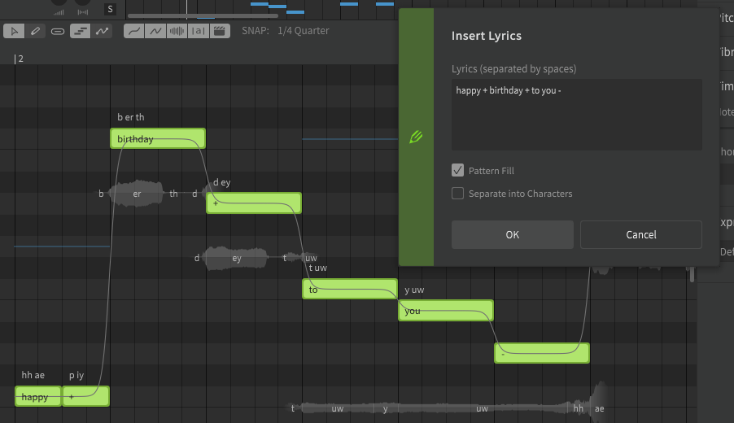

# Batch Lyric Input

Enter lyrics for multiple notes at once by selecting them and using the "Insert Lyrics..." option under the "Modify" top menu, or pressing ++ctrl+l++.

In the case of Chinese and Japanese lyrics where words are not separated by a space, selecting "Separate into Characters" will distribute one character per note.

If the "Pattern Fill" option is selected and there are more notes selected than words entered, the lyrics will be repeated.

## Video Demonstration

<iframe width="560" height="315" src="https://www.youtube-nocookie.com/embed/Gj7UipbHBdw?start=100" title="YouTube video player" frameborder="0" allowfullscreen></iframe>

---

[Report an Issue](https://github.com/claire-west/svstudio-manual/issues/new?template=report-a-problem.md&title=[Page: Batch Lyric Input])