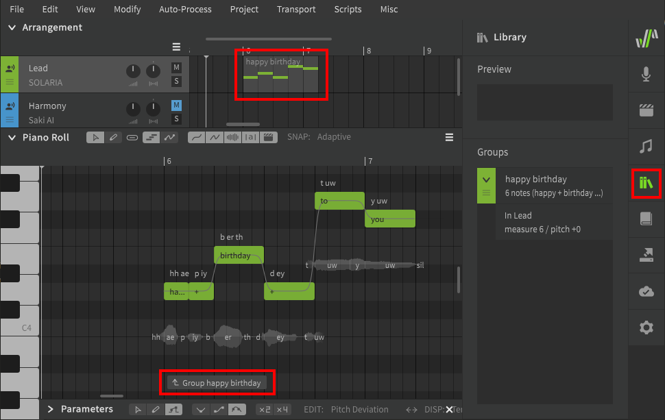
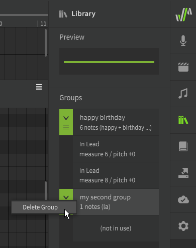

# Groups

When your song has multiple phrases that are the same, groups can help avoid repeating the same work multiple times.

## Grouping Notes

Select the notes and select "Merge Into Group" from the right click menu or "Modify" top menu (default ++alt+g++).

Once a group has been created, it will be indicated in the Arrangement panel, listed in the Library panel, and have an associated handle in the piano roll indicating the start and end of the group. The color of the handle will match the color assigned to the track in the Arrangement panel.

### Managing Groups

Groups can be renamed in the Library panel by double-clicking their name, and can be reordered by dragging the green handle to their left.

A group can be dragged to any point in the Arrangement.

Unlike individual notes, groups can be moved, copied, and pasted within the arrangement panel.

To remove a group from the arrangement, select it and press ++delete++, or delete it from the right click menu.

Even if a group is not present in the arrangement, it will still remain in the Library. To delete a group entirely, right click it in the Library panel and select "Delete Group".

Disbanding a group (++alt+d++) will cause the notes to be ungrouped, but will not remove the group from the Library. The ungrouped notes can be modified freely without influencing the version of the group still present in the Library, even if that group no longer exists within any tracks. If the group is later dragged back into the arrangement, it will resemble the state of the notes from before their grouping was disbanded.

### Modifying a Group

To modify the contents of a group, double-click one of the notes, select the group in the Arrangement panel, or click the handle at bottom of the piano roll. To stop editing a group, click the handle again or press ++esc++.

The area outside the group will be darkened to indicate you are editing the group's contents instead of the track it is part of, and a colored border will indicate the bounds of the group.

A group can have different voice settings (in the Voice panel) from its parent track. This includes base parameter values, vocal modes, and even a different singer. If these values are not set they will be inherited from the parent track.

You can also navigate between groups by right clicking on unoccupied space in the piano roll.

## Multiple Instances of the Same Group

The same group can exist at multiple points within the arrangement. Each time a group is present is called an "instance" of that group, and all instances are listed in the Library panel along with the respective measures they start in.

Group instances remain linked so that changes to one will affect all the others. This includes changes to the notes as well as parameter curves.

To remove this linked behavior, right click on one of the group instances and select "Dissociate Group".

Once the instance has been dissociated, it will be an instance of a new, separate group and can be modified without influencing the other instances of the original group.

If you select "Disband Group" instead of "Dissociate Group", the selected group instance will revert to ungrouped notes, while other instances of the same group will not be affected.

Group instances are treated as separate phrases and therefore do not smoothly transition between one another, even when directly adjacent to notes from another group or the parent track.

### Pitch Offset

If your song has a key change, but multiple phrases before and after that point are otherwise identical, you can add a pitch offset to individual instances of the group.

Without entering the group to edit its contents, click and drag any of the notes up or down. The instance will remain linked to the group it is a part of, but will be a certain pitch higher or lower than the other instances.

## Overlapping Groups

Group instances do not interact with the contents of other groups present in the track, or with the contents of the parent track.

Unlike overlapping notes, groups that overlap can produce output simultaneously because they are treated as separate phrases and their synthesized output is calculated separately. It is generally not recommended to overlap groups in this manner becuase it may complicate the mixing process in your DAW.

### Inherited Parameters

The main exception to the above rule is that group instances will inherit any parameter curves from the underlying parent track.

These inherited parameters will only apply to the group instance at the same point on the time axis and will have no effect on instances of the same group elsewhere in the track or project.

<figure markdown>
  
  <figcaption>Pitch deviation outside the group affecting one instance's notes.</figcaption>
</figure>

## Expanding a Group

A group can be made longer by adding new notes to the end of it, or by dragging the last note in the group to the right.

To add empty space to the start or end of a group, click and drag the left or right borders of the group in the Arrangement Panel to resize it.

## Video Demonstration

<iframe width="560" height="315" src="https://www.youtube-nocookie.com/embed/kIn3CRfI4xs" title="YouTube video player" frameborder="0" allowfullscreen></iframe>

---

[Report an Issue](https://github.com/claire-west/svstudio-manual/issues/new?template=report-a-problem.md&title=[Page: Groups])