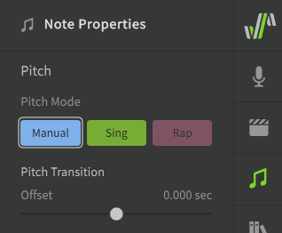
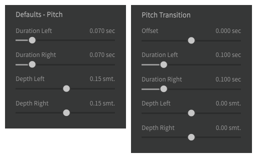
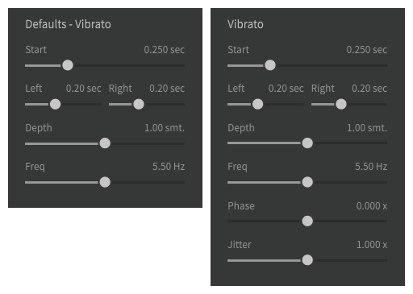
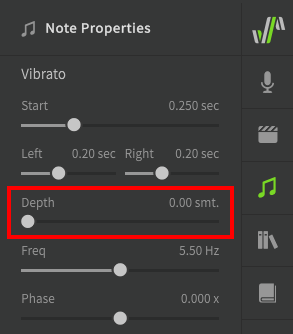
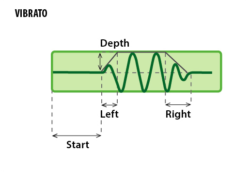
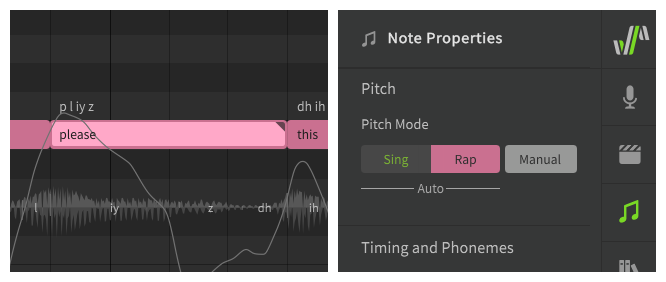

# Manual Pitch Mode

Experienced users will often want the most manual control over the vocals, without influence from AI-generated behaviors.

Notes in Manual pitch mode have a triangle indicator in their upper right corner, and have a flattened pitch line by default.

The color of the note will be based on whether the Sing or Rap pitch mode was selected before swiching to Manual pitch mode, or will default to green if the note is created in Manual mode.

<figure markdown>
  
  <figcaption>A note with Manual Pitch Mode enabled</figcaption>
</figure>

## Manual Pitch Settings

When Manual Pitch Mode is selected, additional transition and vibrato options are made available in the Note Properties panel.

The pitch transition and vibrato settings are meant for quickly setting up a rough pitch outline. The details are expected to be fine-tuned via the [Parameters Panel](../parameters/parameters-panel.md).

Pitch transition controls the part of pitch curve near note boundaries. Vibrato applies to the middle of a note.

The default values of the transition and vibrato sliders are determined by their respective settings in the Voice panel. Some settings can only be set for individual notes and do not have a matching default value set in the Voice panel.

## Pitch Transition

The first set of sliders are related to the transitions between notes.

<figure markdown>
  
  <figcaption>Transition sliders in the Voice (left) and Note Properties (right) panels</figcaption>
</figure>

**Offset**
: Shifts the start of the pitch curve for a note left or right. This will also affect the right transition of the previous note. Offset will not affect the note's vibrato or transition to the following note.

**Duration Left**
: The amount of time between the start of the note and the point where the pitch curve reaches the note's exact pitch. This part of the pitch curve is often referred to as "undershoot", "overshoot", or "correction".

**Duration Right**
: The amount of time before the end of the note where the pitch deviates based on the "Depth Right" setting. This part of the pitch curve is often referred to as "preparation".

**Depth Left**
: Adjusts the pitch near the start of the note and the end of the transition based on the "Duration Left" setting. Negative values result in undershoot and positive values result in overshoot.

**Depth Right**
: Adjusts the pitch neat the end of the note based on the "Duration Right" setting. Negative values will pre-emptively adjust toward the next note and positive values will move away from the next note.

### Transition Settings Visualized

This diagram illustrates how each of the transition sliders affects the pitch curve at the boundary between Note A (lower left) and Note B (upper right).

## Vibrato

The vibrato sliders produce a simple expression-based pattern similar to a sine wave, which can be used to quickly add vibrato to notes.

This expression-based curve is separate from any vibrato-shaped curves introduced by other features, or which have been drawn manually by the user.

!!! note

    Other methods of creating vibrato such as [Auto Pitch Tuning](../ai-functions/auto-pitch-tuning.md) or [Sing Mode](../ai-functions/pitch-mode-sing.md) will create more complex vibrato patterns without using these settings, and those patterns will not be affected by the vibrato sliders or the [Vibrato Envelope](../parameters/editing-parameters.md#vibrato-envelope) parameter.

    While the Vibrato Envelope parameter can affect vibrato generated by Sing Mode while it remains active, it will not continue to do so after Manual Mode is enabled. While in Manual Mode, the Vibrato Envelope parameter only modulates the amplitude of the sine-like curve as dicatated by the Depth slider shown below.

<figure markdown>
  
  <figcaption>Vibrato sliders in the Voice (left) and Note Properties (right) panels</figcaption>
</figure>

**Start**
: The delay before vibrato begins, measured from the start of the note.

**Left**
: The duration of the ease-in behavior before the vibrato reaches its full amplitude.

**Right**
: The duration of the ease-out behavior where the vibrato curve ends at the tail of the note.

**Depth**
: The amplitude (in semitones) of the sine-like curve.
: A depth of zero will result in a flat line (no vibrato).

!!! warning

    Executing [Auto Pitch Tuning](../ai-functions/auto-pitch-tuning.md) will set the vibrato depth of the selected notes to zero, except for notes which have already had their vibrato depth set manually in the Note Properties panel. Once this has happened the vibrato depth will no longer be inherited from the default set in the Voice panel.

    The vibrato depth slider will also be set to zero if the note was formerly set to either [Sing](../ai-functions/pitch-mode-sing.md) or [Rap](../ai-functions/pitch-mode-rap.md) Pitch Mode.

    To continue using the vibrato sliders, increase the vibrato depth in the Note Properties panel for the relevant notes.

    

**Frequency**
: How fast the vibrato oscillates (cycles per second).

**Phase**
: The phase of the sine-wave-like vibrato at its beginning, relative to a full cycle.

**Jitter**
: How much natural pitch fluctuation is added to the pitch curve (non-AI singers only).

### Vibrato Settings Visualized

This diagram illustrates how each of the vibrato sliders affects the pitch curve for a note. The pitch curve before and after the vibrato is based on the Pitch Transition settings described above.

## Creating Notes in Manual Pitch Mode

To make new notes default to Manual Pitch Mode, change the "Note Default Pitch Mode" option in the Settings panel.

## Manual Pitch Mode in Conjunction with Sing or Rap Mode

Enabling Manual Pitch Mode for a note previously set to either Sing or Rap pitch mode can be used to "freeze" the pitch for a note in order to prevent the pitch from being recalculated when a note's context is changed.

<figure markdown>
  
  <figcaption>A note in Manual Pitch Mode which was formerly in Rap mode. The generated pitch curve has been "locked" to prevent accidental future changes.</figcaption>
</figure>

Find more information about switching pitch modes on the [Sing Pitch Mode](../ai-functions/pitch-mode-sing.md#disabling-sing-mode) and [Rap Pitch Mode](../ai-functions/pitch-mode-rap.md#disabling-rap-mode) pages.

---

[Report an Issue](https://github.com/claire-west/svstudio-manual/issues/new?template=report-a-problem.md&title=[Page: Manual Pitch Mode])