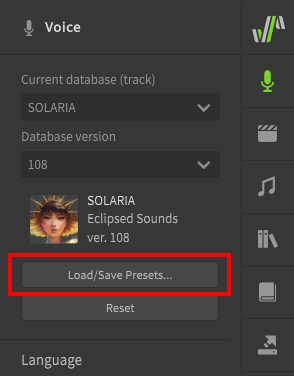

# The Side Panels in Detail

This page covers any information about the side panels that does not fit on a different page, or links to the appropriate page for the relevant feature.

## The Voice Panel

### Singer Selection

**Current Database**
: See [Singer Selection](../quickstart/singer-selection.md)

**Load/Save Presets**
: Allows saving the current Voice panel settings as a preset. This includes Vocal Modes, default parameter values, and default transition/vibrato settings.
: Voice presets are specific to the voice database, so to use a preset for a different singer you must first select the original singer the preset was saved for, load the preset, and then switch to the desired other singer.
: 

### Language

**Sing in the following language**
: See [Editing Phonemes → Cross-lingual Synthesis](../note-properties/editing-phonemes.md#cross-lingual-synthesis)

**Use relaxed consonants**
: Uses phoneme conversion rules more suited to American English.

### Vocal Mode
See [Vocal Modes](../ai-functions/vocal-modes.md)

### Parameters
See [Editing Parameters → Base Values](../parameters/editing-parameters.md#base-values)

### Tuning
Pitch Shift
: Allows pitch-shifting of the current track/group by up to 50 cents in either direction.

Key Shift
: Allows pitch-shifting of the current track/group by up to one octave in either direction.

### Synthesis Engine
Render Mode
: "Prefer Speed" will render faster at the cost of quality, resulting in more noise and synthesis artifacts. "Lite" version voice databases are restricted to this setting.
: "Prefer Quality" will render the full-quality audio output, but may perform slower on some devices.

### Defaults - Pitch
See [Pitch Transition and Vibrato](../note-properties/pitch-transition-and-vibrato.md)

### Defaults - Vibrato
See [Pitch Transition and Vibrato](../note-properties/pitch-transition-and-vibrato.md)

## The AI Retakes Panel
See [AI Retakes](../ai-functions/ai-retakes.md)

## The Note Properties Panel

### Navigation
Selects the previous/next note in the current track/group.

### Language

**Sing in the following language**
: See [Editing Phonemes → Cross-lingual Synthesis](../note-properties/editing-phonemes.md#cross-lingual-synthesis)

### Pitch Transition
See [Pitch Transition and Vibrato](../note-properties/pitch-transition-and-vibrato.md)

### Vibrato
See [Pitch Transition and Vibrato](../note-properties/pitch-transition-and-vibrato.md)

### Timing and Phonemes
**Note Offset**
: See [Note and Phoneme Timing](../note-properties/note-and-phoneme-timing.md)

**Phonemes**
: See [Editing Phonemes](../note-properties/editing-phonemes.md)

**Duration**
: See [Note and Phoneme Timing → Phoneme Timing](../note-properties/note-and-phoneme-timing.md#phoneme-timing) for the sliders, or [Alternate Phonemes and Phoneme Strength](../note-properties/alternate-phonemes.md) for the buttons to the right of the sliders.

**Strength**
: See [Alternate Phonemes and Phoneme Strength → Phoneme Strength](../note-properties/alternate-phonemes.md#phoneme-strength)

### Expression Group
See [Expression Groups](../note-properties/expression-groups.md)

## The Library Panel
See [Groups](groups.md)

## The Dictionary Panel
See [User Dictionaries](user-dictionaries.md)

## The Render Panel
See [Saving the Audio](../quickstart/saving-the-audio.md)

## The License and Updates Panel
See [Setup and Activation](../setup.md)

## The Settings Panel

### General
**Interface Language**
: The language displayed in the Synthesizer V Studio user interface. More translation files can be downloaded from the official Dreamtonics [GitHub repository](https://github.com/Dreamtonics/svstudio-translations).

**Interface Scaling**
: Increases or decreases the size of all visual elements within the application.

**Use OpenGL for UI graphics**
: Use OpenGL for better performance while rendering UI elements. May cause compatibility issues on some platforms.

**Show Status Bar**
: See [The Workspace → The Status Bar](../workspace/layout.md#the-status-bar)

**Automatically check for updates**
: Will check for updates to Synthesizer V Studio and any installed voice databases on startup.

**Allow telementry data collection**
: Sends anonymized usage information to Dreamtonics to improve the software, such as which features are used most often.

### Audio
When standalone, contains options relating to your device's audio hardware.

When used as a plugin, indicates how the output channels will be sent to the DAW (see [DAW Integration → Output Channels](../daw-integration/plugin.md#output-channels)).

**MIDI Input Device**
: See [MIDI Controller Support](midi-controller.md)

**Master Gain**
: Increase or decrease the volume of all audio generated by Synthesizer V Studio (-12dB to +6dB).

### Editor
**Enable instant mode by default**
: See [Instant Mode](../ai-functions/instant-mode.md)

**Follow playheads during playback**
: Whether to move the viewport when the playhead moves out of view during playback.

**Overlap-less note resizing**
: If resizing a note would cause it to overlap with its neighbor, also resize the neighboring note to prevent any overlap.

**Show animated rendering status**
: Highlight the waveform below each note to indicate rendering progress.

**Show character image (if found)**
: Displays the character or brand image for a voice database in the piano roll, if one exists. The image used is based on the `background.png` file in the voice database's installation directory.

**Image Transparency**
: Set the opacity of the character or brand image for the current voice database, if "Show character image" is enabled.

**Horizontal Navigation**, **Horizontal Zooming**, and **Vertical Navigation**
: See [The Workspace → Workspace Navigation](../workspace/layout.md#workspace-navigation)

**2D mouse wheel for scrolling**
: Enable compatibility for mouse wheels that have a side-click function.

**Default Pasting Behavior**
: Indicates whether copied notes or parameter points should be pasted based on the playhead position or the viewport scroll position.

**Note Default Lyrics**
: The default lyric for new notes created in the piano roll.

**Parameter Options**
: See [Editing Parameters → Additional Functions](../parameters/editing-parameters.md#additional-functions)

### Recording
See [MIDI Controller Support → Recording Options](midi-controller.md#recording-options)

### Rendering
**Background Threads**
: The maximum number of concurrent threads to be used during live rendering.

!!! note "Pro Feature - Synthezier V Studio Basic is limited to 2 background rendering threads."

**Playback Buffer Size** and **Engine Sample Rate**
: Audio settings for the live rendering engine. Actual output will use the settings in the [Audio](#audio) section if standalone, or the DAW's audio settings if run as a plugin.
: Final rendered output will use the settings in the Render panel (see [Saving the Audio](../quickstart/saving-the-audio.md)).

**Power Management**
: Limits performance to conserve battery or reduce system load. "Max Performance" will result in the highest system load, but perform faster. "Power Save" will run slower but consume less battery and be less demanding on system hardware.

### Keyboard
Allows a hotkey to be assigned to any option accessible via the top menus, or a script.

---

[Report an Issue](https://github.com/claire-west/svstudio-manual/issues/new?template=report-a-problem.md&title=[Page: Side Panels in Detail])