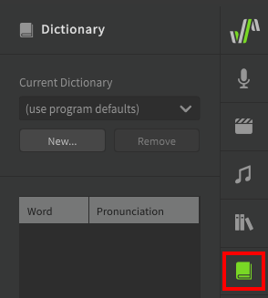
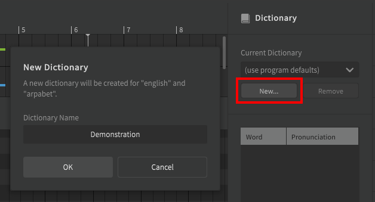
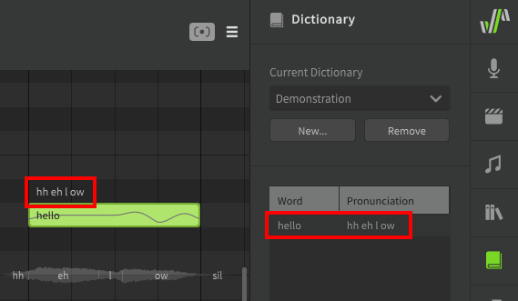
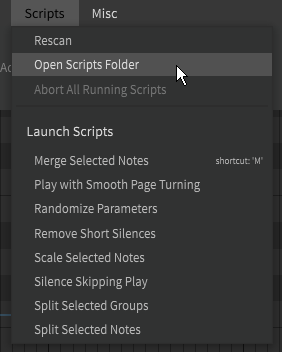
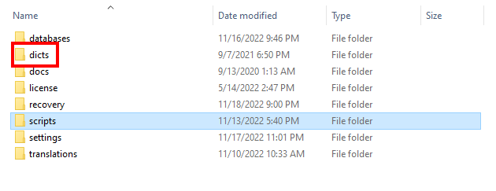

# User Dictionaries

Dictionaries can be used to customize word-to-phoneme conversion.

When a note's lyric is being converted to phonemes, it will first check for an entry in the currently selected dictionary. If there is no custom entry or no dictionary is selected, the default conversion will be used. This can be useful if the same word appears many times in a project and you want all instances of that word to use a [modified phoneme sequence](../note-properties/editing-phonemes.md#changing-a-notes-phonemes).

The Dictionary panel can be accessed from the launch bar.

## Creating a Dictionary

To create a dictionary, open the Dictionary panel and click "New".

Upon creating a dictionary, the currently active track will have the new dictionary selected. Other tracks will still be using the software defaults and must have their dictionary selected via the dropdown.

Each track/group can have a different active dictionary to suit different pronunciations or accents for each vocal layer or singer.

## Adding Dictionary Entries

Add dictionary entries by entering the word and the desired phoneme sequence to be used.

Once a word is present in the active dictionary, all instances of that word in the track/group will use the new phoneme sequence unless their phonemes have been set manually.

!!! note

    The dictionary will only override word-to-phoneme conversion. For example, the entry above maps "hello" to `hh eh l ow` instead of the default `hh ax l ow`, since these are both common pronunciations of the word based on the speaker's accent.

    Attempting to enter the original phoneme sequence (`hh ax l ow`) in the first text box will not result in those phonemes being replaced for a note that has "hello" entered as the lyric.

Notice that the phoneme text above the note is white to indicate that it is based on lyric-to-phoneme conversion rather than manual entry. Dictionary entries will not overwrite phonemes for notes that have had their phonemes manually set (green text).

### Assigning Phonemes to Arbitrary Text

The word entered does not need to be a real word; it can be any text you want to map to the specified phoneme sequence. This can be helpful for differentiating [homographs](../note-properties/editing-phonemes.md#homographs-different-words-with-identical-spelling) (different words that are spelled the same, but pronounced differently), such as the verb and adjective versions of the word "separate".

### Removing Dictionary Entries

To remove a dictionary entry, select it from the list and select "Remove".

## Dictionaries and Cross-lingual Synthesis

!!! note "Pro Feature"

    Cross-lingual Synthesis requires Synthesizer V Studio Pro.

The dictionary list will always be loaded based on the current voice database's native language, even if that does not match the current language selected for cross-lingual synthesis.

For example, to use an English dictionary with a native-Japanese voice database you would first need to move or copy the dictionary file into the `dicts/japanese-romaji` folder, even though the phoneme notation being used via cross-lingual synthesis is arpabet.

The `dicts` folder can be found in the following locations for each operating system:

|Operating System|Folder Location|
|---|---|
|Windows|`Documents\Dreamtonics\Synthesizer V Studio\dicts`|
|MacOS|`/Library/Application Support/Dreamtonics/dicts`|
|Linux|`<your installation directory>/dicts` For example: `/opt/Synthesizer V Studio Pro/dicts`|

For easy access, the dictionaries folder is located in the same location as the [scripts]() folder, and can therefore be located in the same manner by selecting "Open Scripts Folder" from the "Scripts" top menu.

---

[Report an Issue](https://github.com/claire-west/svstudio-manual/issues/new?template=report-a-problem.md&title=[Page: User Dictionaries])