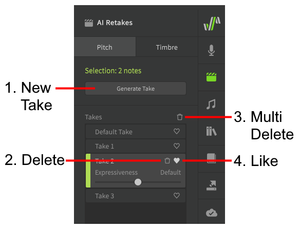
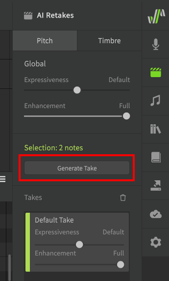
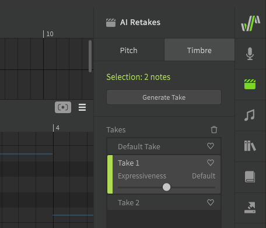
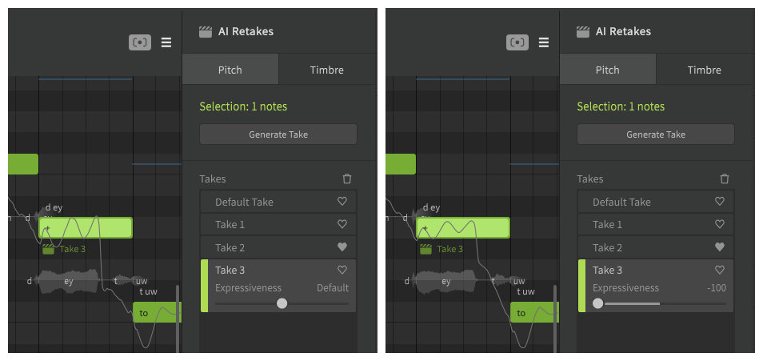

# AI Retakes

!!! note "Pro Feature"

    The features described below require Synthesizer V Studio Pro.

AI Retakes can be accessed via the [launch bar](../workspace/side-panels.md), and allow you to cycle through multiple different generated results for the specified note(s).

## Managing Takes

### 1. New Take
Generate new takes for the selected notes.

### 2. Delete
Remove the take.

### 3. Multi Delete
Options to delete unselected takes ("Crop to Active Takes") or only delete non-marked takes ("Crop to Active/Liked Takes").

### 4. Like
Mark preferred takes.

## Pitch

To generate new takes, select one or more notes and click "Generate Take" from the AI Retakes panel.

!!! info "Pitch retakes can only be generated while [Instant Mode](instant-mode.md) is enabled."

Pitch retakes will produce varying pitch curves, and can be used to fine tune note transitions and vibrato.

By selecting different takes from the list you can see the pitch line change according to the selection.

!!! note

    The pitch deviations introduced by Instant Mode are context-specific, and therefore so are the generated takes. It is recommended that you ensure all notes are correctly placed with the appropriate timings, and all adjacent breaths have been inserted before generating retakes.

<figure markdown>
  
  <figcaption>Comparing three different takes</figcaption>
</figure>

## Timbre

Timbre retakes can be generated in the same manner as pitch retakes, but do not require Instant Mode to be enabled.

These takes will modify the dynamics of the selected notes, but will not change the pitch. This can be helpful for fine-tuning glottal sounds such as vocal fry, or adjusting the harshness of sibilant phonemes.

## Expressiveness

The expressiveness slider can be used to reduce the amplitude of pitch or timbre deviations.

When no notes are selected, this slider will affect the default expressiveness value for all notes in the track or group that have not had their expressiveness values set individually.

## Video Demonstration

<iframe width="560" height="315" src="https://www.youtube-nocookie.com/embed/VyvXI3jEyRo" title="YouTube video player" frameborder="0" allowfullscreen></iframe>

---

[Report an Issue](https://github.com/claire-west/svstudio-manual/issues/new?template=report-a-problem.md&title=[Page: AI Retakes])