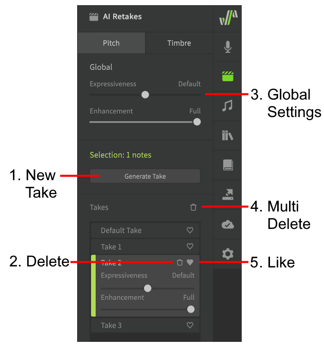

# AI Retakes

!!! note "Pro Feature"

    The features described below require Synthesizer V Studio Pro.

AI Retakes can be accessed via the [launch bar](../workspace/side-panels.md), and allow you to cycle through multiple different generated results for the specified note(s).

## Managing Takes

### 1. New Take

Generate new takes for the selected notes (default ++alt+t++).

### 2. Delete

Remove the take.

### 3. Global Settings

The base Expressiveness and Enhancement values for all takes created for the current track/group.

Changing these values will retroactively affect existing takes. To "lock" the pitch curve of a note and prevent any retroactive changes, change its pitch mode to [Manual](../advanced/pitch-mode-manual.md).

### 4. Multi Delete

Options to delete unselected takes ("Crop to Active Takes") or only delete non-marked takes ("Crop to Active/Liked Takes", default ++shift+alt+t++).

### 5. Like

Mark preferred takes.

If you have [opted in](../setup.md#ai-retakes-feedback-data), your feedback will be sent to Dreamtonics along with a minimal snippet of project data required to reconstruct your preferred retake. This information will be used to improve the generated pitch models in future software updates.

If not opted in, or after opting out of feedback collection, this functions only as a bookmark for your preferences, and no project data will be transmitted to Dreamtonics.

## Pitch

To generate new takes, select one or more notes and click "Generate Take" from the AI Retakes panel.

!!! info "Pitch retakes can only be generated for notes using "Sing" or "Rap" Pitch Modes."

Pitch retakes will produce varying pitch curves, and can be used to fine-tune note transitions and vibrato.

By selecting different takes from the list you can see the pitch line change according to the selection.

!!! note

    The pitch deviations introduced by the "Sing" and "Rap" Pitch Modes are context-specific, and therefore so are the generated takes. It is recommended that you ensure all notes are correctly placed with the appropriate timings, and all adjacent breaths have been inserted before generating retakes.

<figure markdown>
  
  <figcaption>Comparing three different takes</figcaption>
</figure>

## Timbre

Timbre retakes can be generated in the same manner as pitch retakes, but are also available in Manual Pitch Mode.

These takes will modify the various qualities of a sound which are unrelated to pitch, such as tone color, dynamics, enunciation, and more. This can be helpful for fine-tuning glottal sounds such as vocal fry, creating a smoother transition between notes, or adjusting the harshness of sibilant phonemes.

## Expressiveness

The expressiveness slider can be used to adjust the amplitude/intensity of pitch or timbre deviations.

## Enhancement

The enhancement slider determines how much the generated pitch patterns will be influenced by feedback collected from other users and surveys conducted by Dreamtonics.

Feedback-based enhancement is only available for Pitch retakes.

## Randomness and Probability

Generating new AI Retakes is comparable to rolling a die multiple times; the probability distribution and set of possible results does not change when a new "take" is generated, but you gain the ability to cycle through and select from many possibilites based on the same input or situation.

In programming terms, generating new retakes executes the same process multiple times, with a different [random seed](https://en.wikipedia.org/wiki/Random_seed) for each execution.

### Influencing the Possible Results

The possible results for AI Retakes will vary based on multiple factors:

* The selected voice database
* The note's context (pitch, duration, phonemes, and those properties of the neighboring notes)
* [Vocal Mode](vocal-modes.md) settings (only affects timbre retakes)

If any of these factors change, the resulting AI Retakes may also be different – even if they have already been generated.

### Bias in Machine Learning Models

Each voice database (and vocal mode) contains certain biases based on the original recordings of the voice provider's singing.

For voice databases that are inclined to use vocal fry, you may need to generate more timbre retakes to find one without that behavior. Similarly, some voice databases will have little to no bias toward that behavior, and therefore may not produce that result in any situation.

This same concept also applies to other aspects of the vocals, such as transitions, vibrato, dynamics, and more.

## Video Demonstration

<iframe width="560" height="315" src="https://www.youtube-nocookie.com/embed/VyvXI3jEyRo" title="YouTube video player" frameborder="0" allowfullscreen></iframe>

---

[Report an Issue](https://github.com/claire-west/svstudio-manual/issues/new?template=report-a-problem.md&title=[Page: AI Retakes])