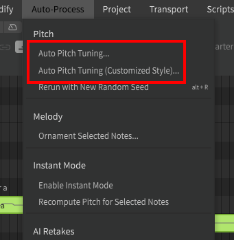
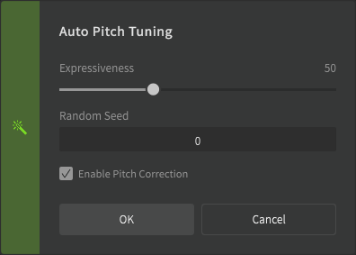
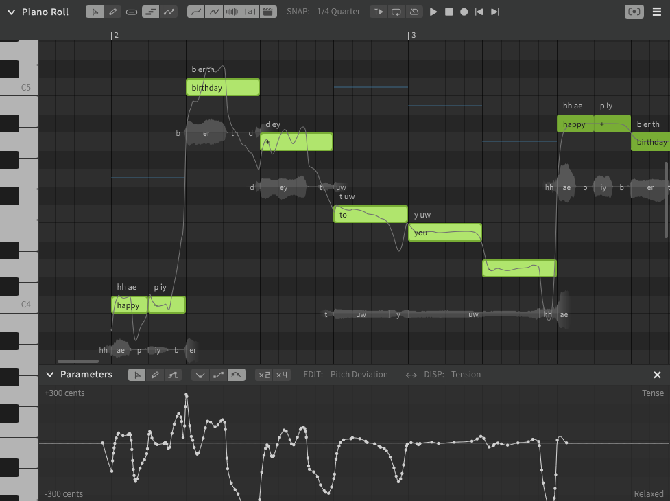
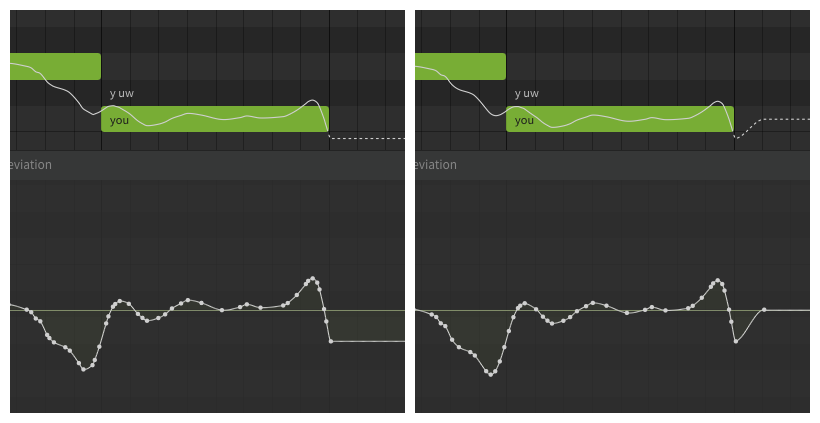
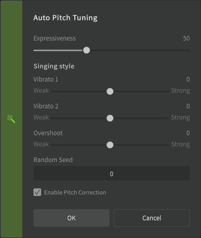
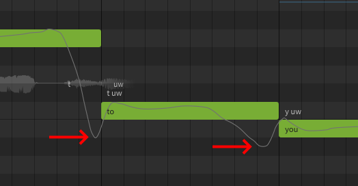

# Auto Pitch Tuning

Auto pitch tuning is a function found under the "Auto-Process" top menu. The "(Customized Style)" option offers additional vibrato and overshoot sliders when using the Pro edition.

## Executing Auto Pitch Tuning

Executing auto pitch tuning will add pitch deviations to the parameters panel for the currently-selected notes. These pitch deviations will be different based on the currently selected voice database, and are based on machine learning analysis of the original voice provider's singing style.

See [Editing Notes](../quickstart/editing-notes.md#selecting-notes) for methods of selecting many notes at once using hotkeys and modifier keys.

!!! info "Auto Pitch Tuning can only be executed for notes that are set to [Manual Pitch Mode](../advanced/pitch-mode-manual.md)."

The pitch deviations introduced by Auto Pitch Tuning are context-specific.

A note's "context" is based on its pitch, duration, and phonemes, as well as those same properties of the notes before and after it. If any of these things change, the results of auto pitch tuning will be different.

### Expressiveness
The expressiveness slider determines how drastic the pitch deviations are and how far they deviate from the notes.

<figure markdown>
  
  <figcaption>Expressiveness setting of 100 (left) and 25 (right)</figcaption>
</figure>

### Pitch Correction

The "Enable Pitch Correction" checkbox will attempt to prevent AI-generated improvisations from being generally flat or sharp relative to the notes in the piano roll.

This feature calculates the average pitch over the duration of a note and shifts the entire curve for the note so that it closer matches the exact pitch indicated by the note's vertical position in the piano roll.

In this example the note is somewhat sharp when Auto Pitch Tuning is executed without pitch correction. When re-run with the setting enabled, the note's pitch curve is shifted downward to be closer to the center of the note. The shape of the curve is not changed.

<figure markdown>
  
  <figcaption>Pitch correction off (left) and on (right)</figcaption>
</figure>

It is important to note that these corrections are calculated for each note, not in a moment-to-moment manner. Notice how the pitch curves move up or down in segments that align with the notes in the piano roll.

This video shows a comparison of the same sequence without (before) and with (after) pitch correction enabled.

### Rerun with New Random Seed

The "Rerun with New Random Seed" option will generate a different pitch curve, even if the note's context has not changed. This can be used to cycle through different "takes".

## Customized Style Options

!!! note "Pro Feature - Auto Pitch Tuning (Customized Style) is only available in Synthesizer V Studio Pro."

!!! warning "Speculative Information"

    There is no clear guidance from Dreamtonics about this topic. The information below is based on user observation and may not be entirely accurate.

When executing the "Customized Style" version of Auto Pitch Tuning, additional sliders will be added to the dialog in addition to the usual expressiveness slider.

#### Vibrato 1

"Strong" settings will result in the AI engine being more "choosy" when applying AI-generated pitch deviations (both vibrato and overshoot). "Weak" settings will allow pitch deviations to be applied to more notes, more intensely.

#### Vibrato 2

Affects the intensity of AI-generated vibrato.

#### Overshoot

Affects the intensity of pitch deviations extending past the note before and after pitch transitions.

---

[Report an Issue](https://github.com/claire-west/svstudio-manual/issues/new?template=report-a-problem.md&title=[Page: Auto Pitch Tuning])