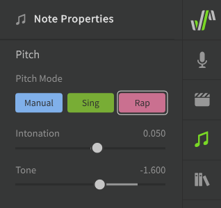
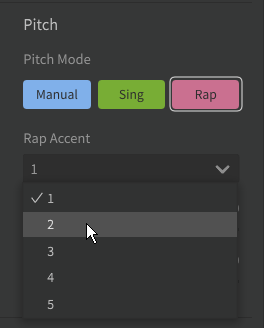

# Rap Pitch Mode

"Rap" Pitch Mode will add AI-generated pitch deviations to your notes which are modeled to mimic human rap techniques, and allows the use of the Rap Intonation parameter.

!!! warning

    Rap Mode is not yet available for Cantonese Chinese or Spanish.

## Enabling Rap Mode

Rap mode can be enabled for notes via the Note Properties menu. Notes using Rap mode will be red in the Piano Roll.

Notice that the "Manual" button is dark, indicating that Manual Pitch Mode is disabled and that pitch curves will be generated automatically.

!!! info

    The pitch deviations introduced by Rap Mode are context-specific.

    A note's "context" is based on its pitch, duration, and phonemes, as well as those same properties of the notes before and after it. If any of these things change, the pitch deviations for the note will be recalculated.

    If you like the generated pitch pattern for a note or sequence, consider enabling [Manual Mode](../advanced/pitch-mode-manual.md) for it to avoid accidentally triggering the automated pitch recalculation.

Enabling Rap Mode also allows the use of pitch [AI Retakes](ai-retakes.md).

### Rap Accent

The Rap Accent dropdown can be used to produce variations of a note.

This option is only available for Mandarin Chinese.

### Intonation

Causes the pitch of the note to rise or fall over its duration.

The value of this slider is directly linked to the upward or downward curve of the Rap Intonation parameter for the note.

### Tone

Modifies the overall pitch of the note to be higher or lower, without affecting the change in intonation over its duration. The value is represented in semitones.

The value of this slider is directly linked to the vertical position of the Rap Intonation parameter for the note.

## The Rap Intonation Parameter

The Rap Intonation parameter allows easy editing of pitch movement and intonation throughout a note or phrase. Unlike other parameters, Rap Intonation is represented as a series of arrows rather than a continuous curve.

Each arrow represents the pitch movement over the duration of the associated note. The position of each arrow is directly linked to the sliders in the Note Properties panel.

To modify the arrow's vertical position (Tone), click and drag the line portion of the arrow. To change the curve (Intonation), click and drag the head of the arrow instead.

## Disabling Automatic Pitch Generation

If you enable [Manual Pitch Mode](../advanced/pitch-mode-manual.md) after Rap Mode has already been active:

* The generated pitch deviations will be moved to the parameters panel for further manual editing
* The vibrato depth setting will default to zero instead of inheriting its value from the default set in the Voice panel
* The Rap Intonation parameter will no longer be available for the note, but the setting will not be lost and intonation editing can be restored by re-enabling Rap Mode

This means the pitch curve for the note(s) will be the same as before enabling Manual Pitch Mode. Disabling Rap Mode can be helpful if you want to "freeze" the generated pitch deviations, so that they are not recalculated if the note's context changes.

### Switching from Manual Pitch Mode to Rap Mode

Changing a note from Manual Pitch Mode to Rap Pitch Mode will overwrite any existing pitch deviations in the parameters panel. Re-enabling Manual Pitch Mode will not restore the overwritten pitch deviations.

## Video Demonstration

<iframe width="560" height="315" src="https://www.youtube-nocookie.com/embed/Z6OB3jHiBBk" title="YouTube video player" frameborder="0" allowfullscreen></iframe>

---

[Report an Issue](https://github.com/claire-west/svstudio-manual/issues/new?template=report-a-problem.md&title=[Page: Rap Pitch Mode])