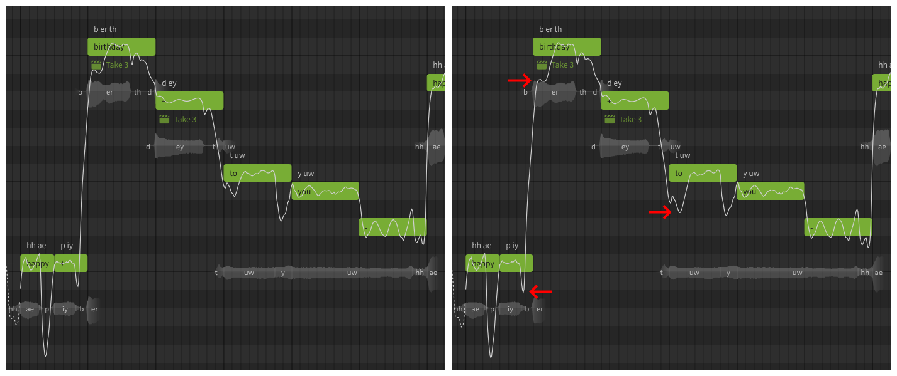
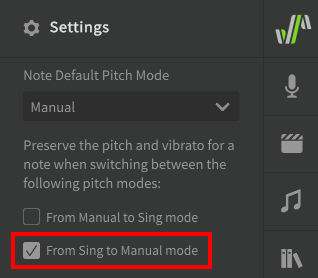
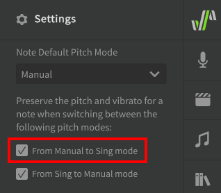

# Pitch Mode: Sing

"Sing" Pitch Mode (formerly "Instant Mode" or "Simple Pitch Mode") will add AI-generated pitch deviations to your notes which are modeled to produce realistic transitions, sustains, and vibrato.

Sing Mode is comparable to the preset libraries included with traditional software synthesizers and effects plugins; it can help new users get results quickly, acts as a starting point for further modification, and can help users learn what realistic pitch curves might look and sound like.

Experienced users may prefer to use [Manual Pitch Mode](../advanced/pitch-mode-manual.md) for full control over the vocals, or in order to manually execute [Auto Pitch Tuning](auto-pitch-tuning.md) for greater customization of the AI-generated pitch curves.

## Enabling Sing Mode

Sing mode can be enabled for notes from the Note Properties menu. Notes using Sing mode will be green in the Piano Roll.

Notice that the "Manual" button is dark, indicating that Manual Pitch Mode is disabled and that pitch curves will be generated automatically.

!!! info

    The pitch deviations introduced by Sing Mode are context-specific.

    A note's "context" is based on its pitch, duration, and phonemes, as well as those same properties of the notes before and after it. If any of these things change, the pitch deviations for the note will be recalculated.

    If you like the generated pitch pattern for a note or sequence, consider enabling [Manual Mode](../advanced/pitch-mode-manual.md) for it to avoid accidentally triggering the automated pitch recalculation.

Enabling Sing mode also allows the use of pitch [AI Retakes](ai-retakes.md).

### Vibrato Modulation

!!! note "Pro Feature"

    The Vibrato Modulation setting is only available in Synthesizer V Studio Pro.

The vibrato modulation setting affects the depth (amplitude) of the vibrato portion of the generated pitch deviations. This can be further modulated over the duration of the note using the [Vibrato Envelope](../parameters/editing-parameters.md#vibrato-envelope) parameter.

The default value of the vibrato modulation slider is set in the Voice panel.

### Improvise Note Attack and Release

!!! note "Pro Feature"

    The Improvise Note Attack and Release setting is only available in Synthesizer V Studio Pro.

This setting will cause the generated pitch transitions to deviate further from the note's exact pitch. The improvisation will be most evident between notes with larger pitch differences.

Improvise Note Attack and Release can only be set for the entire track/group in the Voice panel.

<figure markdown>
  
  <figcaption>A sequence with Improvise Note Attack and Release disabled (left) and enabled (right)</figcaption>
</figure>

## Disabling Sing Mode

If you enable Manual Pitch Mode after Sing Mode has already been active:

* The generated pitch deviations will be moved to the parameters panel for further manual editing
* The vibrato depth setting will default to zero instead of inheriting its value from the default set in the Voice panel

This means the pitch curve for the note(s) will be the same as before switching to Manual Pitch Mode. Disabling Sing Mode can be helpful if you want to "freeze" the generated pitch deviations, such that they are not recalculated if the note's context changes.

This behavior can be changed by disabling the "From Sing to Manual mode" option in the settings panel.

## Switching from Manual Pitch Mode to Sing Mode

Changing a note from Manual Pitch Mode to Sing Pitch Mode will overwrite any existing pitch deviations in the parameters panel. Switching back to Manual Pitch Mode will not restore the overwritten pitch deviations.

This behavior can be changed by enabling the "From Manual to Sing mode" option in the settings panel.

## Video Demonstration

<iframe width="560" height="315" src="https://www.youtube-nocookie.com/embed/Z6OB3jHiBBk" title="YouTube video player" frameborder="0" allowfullscreen></iframe>

---

[Report an Issue](https://github.com/claire-west/svstudio-manual/issues/new?template=report-a-problem.md&title=[Page: Sing Pitch Mode])