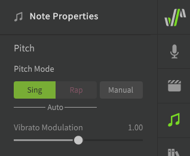

# Pitch Mode: Sing

"Sing" Pitch Mode (formerly "Instant Mode" or "Simple Pitch Mode") will add AI-generated pitch deviations to your notes which are modeled to mimic human singing techniques.

## Enabling Sing Mode

Sing mode can be enabled for notes from the Note Properties menu. Notes using Sing mode will be green in the Piano Roll.

!!! info

    The pitch deviations introduced by Sing Mode are context-specific.

    A note's "context" is based on its pitch, duration, and phonemes, as well as those same properties of the notes before and after it. If any of these things change, the pitch deviations for the note will be recalculated.

Enabling Sing mode also allows the use of pitch [AI Retakes](ai-retakes.md).

### Vibrato Modulation

The vibrato modulation setting affects the depth (amplitude) of the vibrato portion of the generated pitch deviations. This can be further modulated over the duration of the note using the [Vibrato Envelope](../parameters/editing-parameters.md#vibrato-envelope) parameter.

The default value of the vibrato modulation slider is set in the Voice panel.

### Improvise Note Attack and Release

If Improvise Note Attack and Release is enabled, Sing Mode will not only generate pitch transitions between notes, but also the initial attack and final release of a sequence, as well as the transitions to and from notes set to Manual Pitch Mode.

This can only be set for the entire track/group in the Voice panel.

## Disabling Sing Mode

If you switch to Manual Pitch Mode after Sing Mode has already been active:

* The generated pitch deviations will be moved to the parameters panel for further manual editing
* The vibrato depth setting will default to zero instead of inheriting its value from the default set in the Voice panel

This means the pitch curve for the note(s) will be the same as before switching to Manual Pitch Mode. Disabling Sing Mode can be helpful if you want to make the generated pitch deviations persistent, such that they are not recalculated if the note's context changes.

## Switching from Manual Pitch Mode to Sing Mode

Changing a note from Manual Pitch Mode to Sing Pitch Mode will overwrite any existing pitch deviations in the parameters panel. Switching back to Manual Pitch Mode will not restore the overwritten pitch deviations.

## Video Demonstration

<iframe width="560" height="315" src="https://www.youtube-nocookie.com/embed/Z6OB3jHiBBk" title="YouTube video player" frameborder="0" allowfullscreen></iframe>

---

[Report an Issue](https://github.com/claire-west/svstudio-manual/issues/new?template=report-a-problem.md&title=[Page: Sing Pitch Mode])