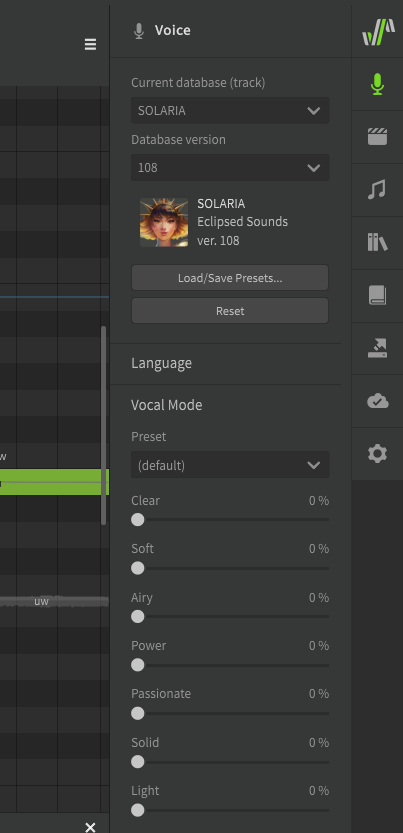

--8<--
notice.md
--8<--

# Vocal Modes

!!! note "Pro Feature"

    The features described below require Synthesizer V Studio Pro.

## Using Vocal Modes
Vocal modes can be found in the Voice panel. Each AI voice database has a number of presets which can be used to customize vocal timbre, articulation, and dynamics. The presets available vary between each AI voice database.

Vocal modes can be used individually or in combination, and different settings can be used for each track or group.

The slider for each vocal mode can be set to values from 0% to 150%. Vocal mode settings over 100% involve extrapolation beyond the original machine learning analysis, and may result in more noticeable synthesis artifacts.

## Modifying Vocal Modes Over Time

Vocal Modes can be selected in the [parameters panel](../parameters/editing-parameters.md). The vocal mode setting will deviate from the base value set in the Voice panel based on the parameter curve.

## Removing Unused Vocal Mode Parameters

If a Vocal Mode parameter is initialized and then the singer is changed to a voice database that does not support the same vocal mode, the incompatible vocal mode will be marked as inactive.

The parameter curve will remain in the project in case you decide to switch back to the original voice database, but you can also remove any inactive vocal modes by selecting the trash can icon from the parameter selection menu.

## Video Demonstration

<iframe width="560" height="315" src="https://www.youtube-nocookie.com/embed/LWgNp56hvqQ" title="YouTube video player" frameborder="0" allowfullscreen></iframe>

---

[Report an Issue](https://github.com/claire-west/svstudio-manual/issues/new?template=report-a-problem.md&title=[Page: Vocal Modes])
