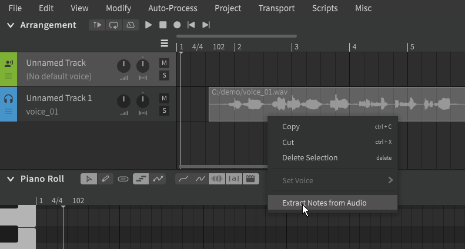
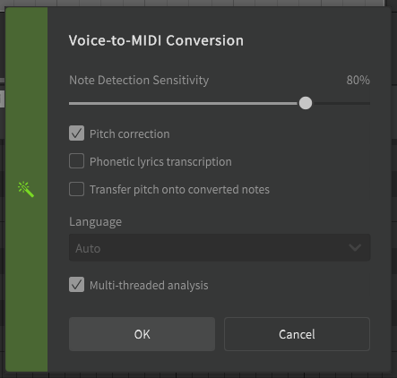

# Voice-to-MIDI Conversion

!!! note "Pro Feature"

    The features described below require Synthesizer V Studio Pro.

Synthesizer V Studio can transcribe a MIDI sequence based on a monophonic audio sample.

Right-click on either an instrumental preview or [ARA-synced group](../daw-integration/ara-plugin.md) in the Arrangement Panel and select "Extract Notes from Audio".

## Conversion Options

#### Note Detection Sensitivity

Higher values will be more accurate, but may be prone to erroneously creating more notes than necessary and separating single sustains into multiple notes if there are fluctuations in dynamics.

#### Pitch Correction

If disabled, [detuned notes](../advanced/note-detuning.md) may be present in the transcribed MIDI.

#### Phonetic Lyric Transcription

Detects the phonetic content of the audio sample and attempts to assign phonemes to the transcribed notes to match the phonetic content of the original performance. The accuracy of this will be largely reliant on the clarity of the original recording.

If not selected, the default lyric as defined in the Settings panel will be assigned to each note ("la" by default).

#### Transfer Pitch onto Converted Notes

Adds pitch deviations to the [Parameters Panel](../parameters/parameters-panel.md) to match the pitch of the original audio in a moment-to-moment manner. Transcribed notes will have [Manual Pitch Mode](../advanced/pitch-mode-manual.md) enabled so that the detected pitch is not overwritten by automatic pitch generation.

If not selected, the notes will default to [Sing Pitch Mode](pitch-mode-sing.md) and an AI-generated pitch curve will be applied to them.

#### Language

If "Phonetic Lyrics Transcription" is enabled, the Language dropdown can be used to restrict the transcription to a specific language's phoneme set.

#### Multi-threaded analysis

If enabled, Voice-to-MIDI Conversion will complete more quickly. If reducing CPU load or heat is a priority, you may opt to disable this option in exchange for slower processing times.

## Working with Converted MIDI

After the conversion process has completed, the transcribed MIDI will be added to the currently selected track as a [Note Group](../advanced/groups.md).

The conversion process will not quantize the notes, and may have inaccurate phoneme transcriptions. Depending on the accuracy of the original audio's timing, you may want to execute "Smart Quantization" from the "Modify" top menu on the notes. You should also review the results to identify any incorrect phonemes or pronunciations that may need adjusting.

## Video Demonstration

<iframe width="560" height="315" src="https://www.youtube-nocookie.com/embed/0ijQ9nLPGe0" title="YouTube video player" frameborder="0" allowfullscreen></iframe>

## Troubleshooting

If you encounter technical issues with the plugin, try removing the software and reinstalling to the default installation directory.

If the problems persist, search for similar issues on the [official forums](https://forum.synthesizerv.com/search) or contact [Dreamtonics support](../support.md).

---

[Report an Issue](https://github.com/claire-west/svstudio-manual/issues/new?template=report-a-problem.md&title=[Page: Voice-to-MIDI Conversion])