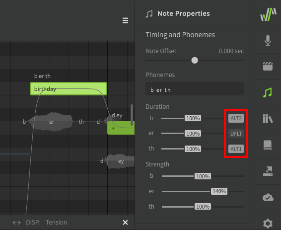
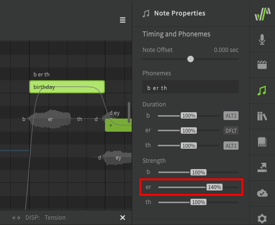

# Alternate Phonemes and Phoneme Strength

!!! note "Pro Feature"

    The features described below require Synthesizer V Studio Pro.

Alternate Phonemes and Phoneme Strength are found in the "Timing and Phonemes" section of the Note Properties panel and can be used to customize each individual sound.

## Alternate Phonemes

When an alternate phoneme is selected, a different articulation or pronunciation will be used during rendering. The results of this setting will vary with each voice database.

## Phoneme Strength

Phoneme strength (AI voice databases only) will modify the dynamics and emphasis of individual phonemes within a note.

---

[Report an Issue](https://github.com/claire-west/svstudio-manual/issues/new?template=report-a-problem.md&title=[Page: Alternate Phonemes])