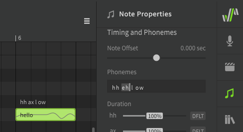
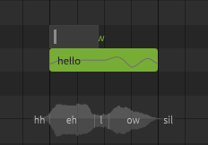

# Editing Phonemes

Phonemes are the individual components that lyrics and syllables are made up of. Each phoneme represents a specific sound that Synthesizer V Studio is capable of producing (along with transition sounds between each phoneme).

All lyrics entered into notes are automatically converted to phonemes. When rendering the synthesized output, the phonemes are used to determine the appropriate pronunciation and timing.

!!! info

    The default dictionary mappings for each lyric will produce the most likely "correct" pronunciation for the word.

    It is rare that human vocalists sing with perfect enunciation, so to achieve the most natural result it is normal to make phoneme adjustments to achieve different pronunciation.

## Available Phonemes

Each language has its own set of phonemes and notations.

A full list of phonemes for each language can be found on the [Phoneme Reference](../phonemes.md) page, as well as in Synthesizer V Studio's installation directory.

|Language|Lyrical Notation|Phonetic Notation|
|---|---|---|
|English|Words|Modified Arpabet|
|Japanese|Hiragana, Katakana, Romaji|Romaji-derived symbols|
|Mandarin Chinese|Chinese characters (simplified/traditional), Pinyin|X-SAMPA|
|Cantonese Chinese|Chinese characters (simplified/traditional), Jyutping|X-SAMPA|

## Changing a Note's Phonemes

Phonemes are displayed above a note, as well as in the Note Properties panel when the note is selected.

If the text above the note is white, this means the phoneme sequence for the note is automatically being converted from the lyric entered inside the note (either from the active [dictionary](../advanced/user-dictionaries.md) or by default phoneme conversion).

There are times where the default pronunciation does not match your song. For example, `hh ax l ow` and `hh eh l ow` are both common pronunciations for the word "hello" depending on the speaker's accent.

Double click on the phoneme text above a note to enter a modified phoneme sequence. Press ++enter++ or click outside the note to confirm, or press ++esc++ to cancel the change.

Pressing ++tab++ will confirm the change and advance to the next note, while ++ctrl+tab++ will move to the previous note.

You can also use the text input in the Note Properties panel instead of double-clicking above the note.

After manually modifying the phoneme sequence the text above the note will be green instead of white. When a note's phonemes have been entered manually in this way, the lyric inside the note will have no effect on the synthesized output.

To revert the phoneme sequence to the automatic lyric-based conversion, set the phoneme sequence to an empty value.

A phoneme sequence can also be entered within a note by prefixing it with a `.` character. This format is primarily used for backwards compatibility with .s5p project files, and it is recommended to enter phonemes above the note when using Synthesizer V Studio.

## Separating Words in Unique Ways

While the `+` and `-` characters [allow words to span multiple notes](../quickstart/entering-lyrics.md) on their vowels and  syllable boundaries, there may be situations in which you want to separate a note in a more precise manner.

Manually allocating a word's phonemes in different ways can be a useful method of [adjusting timing](note-and-phoneme-timing.md#more-precise-timing-adjustments) or articulation. Since human vocalists most often perform transitions at vowel and syllable breaks, care should be taken not to create a halting or unnatural sound using this technique.

This example demonstrates the same lyric as above – "hello" – allocated to notes in a variety of ways using manual phoneme entry.

Notice that in the last example, the `hh` phoneme is no longer treated as a [preutterance](note-and-phoneme-timing.md#note-offset) (which normally occurs before the start of the note) because it is the only phoneme allocated to its respective note.

Keep in mind that if a phoneme sequence has been manually set, the lyric inside the note no longer has any effect on the output.

## Custom Lyric-to-Phoneme Conversion

If there are many instances of the same word in your project, you may want to override the default phoneme conversion for all instances of that lyric. This can be accomplished by creating a [User Dictionary](../advanced/user-dictionaries.md).

## Cross-lingual Synthesis

!!! note "Pro Feature"

    Cross-lingual Synthesis requires Synthesizer V Studio Pro.

Cross-lingual synthesis allows AI voice databases to access the phoneme lists for English, Japanese, Mandarin Chinese, and Cantonese Chinese regardless of their default language. While AI voice databases still have a "native" language, this allows them to sing lyrics in other languages with near-fluency.

Language settings can be found under the Voice and Note Properties panel, for the track/group and individual notes respectively.

---

[Report an Issue](https://github.com/claire-west/svstudio-manual/issues/new?template=report-a-problem.md&title=[Page: Editing Phonemes])