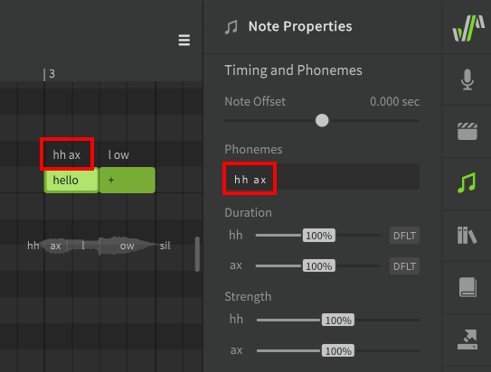
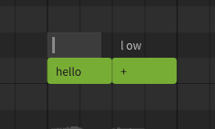

# Editing Phonemes

Phonemes are the individual components that lyrics and syllables are made up of. Each phoneme represents a specific sound that Synthesizer V Studio is capable of producing (along with transition sounds between each phoneme).

All lyrics entered into notes are automatically converted to phonemes. When rendering the synthesized output, the phonemes are used to determine the appropriate pronunciation and timing.

!!! info

    The default dictionary mappings for each lyric will produce the most likely "correct" pronunciation for the word.

    It is rare that human vocalists sing with perfect enunciation, so to achieve the most natural result it is normal to make phoneme adjustments to achieve different pronunciation.

## Available Phonemes

Each language has its own set of phonemes and notations.

A full list of phonemes for each language can be found on the [Phoneme Reference](../phonemes.md) page, as well as in Synthesizer V Studio's installation directory.

|Language|Lyrical Notation|Phonetic Notation|
|---|---|---|
|English|Words|Modified Arpabet|
|Japanese|Hiragana, Katakana, Romaji|Romaji-derived symbols|
|Mandarin Chinese|Chinese characters (simplified/traditional), Pinyin|X-SAMPA|
|Cantonese Chinese|Chinese characters (simplified/traditional), Jyutping|X-SAMPA|

## Changing a Note's Phonemes

Phonemes are displayed above a note, as well as in the Note Properties panel when the note is selected.

If the text above the note is white, this means the phoneme sequence for the note is automatically being converted from the lyric entered inside the note (either from the active [dictionary](../advanced/user-dictionaries.md) or by default phoneme conversion).

There are times where the default pronunciation does not match your song. For example, `hh ax l ow` and `hh eh l ow` are both common pronunciations for the word "hello" depending on the speaker's accent.

Double click on the phoneme text above a note to enter a modified phoneme sequence. Press ++enter++ or click outside the note to confirm, or press ++esc++ to cancel the change.

Pressing ++tab++ will confirm the change and advance to the next note, while ++ctrl+tab++ will move to the previous note.

You can also use the text input in the Note Properties panel instead of double-clicking above the note.

After manually modifying the phoneme sequence the text above the note will be green instead of white. When a note's phonemes have been entered manually in this way, the lyric inside the note will have no effect on the synthesized output.

To revert the phoneme sequence to the automatic lyric-based conversion, set the phoneme sequence to an empty value.

A phoneme sequence can also be entered within a note by prefixing it with a `.` character. This format is primarily used for backwards compatibility with .s5p project files, and it is recommended to enter phonemes above the note when using Synthesizer V Studio.

This format may interfere with the software's ability to infer syllable breaks when using `+`, since there will no longer be a word within the note.

## Separating Words in Unique Ways

While the `+` and `-` characters [allow words to span multiple notes](../quickstart/entering-lyrics.md) on their vowels and  syllable boundaries, there may be situations in which you want to separate a note in a more precise manner.

Manually allocating a word's phonemes in different ways can be a useful method of [adjusting timing](note-and-phoneme-timing.md#more-precise-timing-adjustments) or articulation. Since human vocalists most often perform transitions at vowel and syllable breaks, care should be taken not to create a halting or unnatural sound using this technique.

This example demonstrates the same lyric as above – "hello" – allocated to notes in a variety of ways using manual phoneme entry.

Notice that in the last example, the `hh` phoneme is no longer treated as a [preutterance](note-and-phoneme-timing.md#note-offset) (which normally occurs before the start of the note) because it is the only phoneme allocated to its respective note.

Keep in mind that if a phoneme sequence has been manually set, the lyric inside the note no longer has any effect on the output.

## Custom Lyric-to-Phoneme Conversion

If there are many instances of the same word in your project, you may want to override the default phoneme conversion for all instances of that lyric. This can be accomplished by creating a [User Dictionary](../advanced/user-dictionaries.md).

## Homographs (different words with identical spelling)

Some English words are spelled the same, but have multiple different pronunciations, even within the same accent or dialect. For example, you might **separate** (verb) two objects in order to keep them **separate** (adjective).

In some cases, there will be another word that can be easily subsituted. For example, the default phoneme mapping will interperet "tears" as the ripping of paper, rather than the water that comes from your eyes when you cry. For this scenario, you can easily produce the other phoneme sequence with the word "tiers", which has a different meaning but the desired pronunciation.

In other cases, where there is no simple substitution to be made, it can be helpful to add a [dictionary entry](../advanced/user-dictionaries.md) for the word with the other pronunciation, or a second phoneme mapping if both pronunciations are needed.

For example, if you need both versions of the word "separate" in your track, you can keep the default verb pronunciation as "separate", while adding the adjective pronunciation as a dictionary entry with a different label like "separate2".

### The Word "The"

In Synthesizer V Studio, "the" is a special case. When using the default English phoneme mapping, the phoneme sequence will depend on whether it comes before a consonant or a vowel sound.

When no word follows, the phoneme sequence will be as though it preceded a consonant. To force the other pronunciation, you can use "thee" as the lyric instead, or modify the phoneme sequence directly.

## "Lazy" Pronunciation

People often do not enunciate clearly when singing, using what might be considered "incorrect" pronunciations. Some of the most common phonetic changes to make in Synthesizer V Studio involve replacing over-enunciated words with "lazier" counterparts.

One of the most common examples of this in English is the use of the [alveolar tap](https://en.wikipedia.org/wiki/Voiced_dental_and_alveolar_taps_and_flaps) (`dx`) instead of a clear `t` sound, such as in the word "better", "party", and "water". The exact words that fit this pattern (or other similar patterns) will vary based on regional accent or dialect.

It is also common in many languages to substitute a variety of vowel sounds with a [schwa](https://en.wikipedia.org/wiki/Schwa) (`ax`), or omit a vowel entirely. This can often reduce understandability if applied too liberally, but when used appropriately can result in more natural-sounding vocals.

English speakers will also often drop the final consonant of a word (usually the `t` from a word ending in "n't") and use a [glottal stop](https://en.wikipedia.org/wiki/Glottal_stop) ("ʔ", represented in Synthesizer V Studio as `cl`) to cut off the sound abruptly. This is most common with phrases like "donʔ do it" or "wouldnʔ you?" (though "wouldn't you" can sometimes also be shortened to "wouldn-tyu" or "wouldn-chu", which are all examples of connected speech as mentioned in the next section).

These are some examples of words that might sound overly formal or unusual if enunciated "properly":

|Word|Default Phoneme Sequence|"Lazy" Pronunciation|
|---|---|---|
|Camera|k ae m er ax|k ae m **r** ax|
|Don't → Don'|d ow n t|d ow n **cl**|
|Party|p aa r t iy|p aa r **dx** iy|
|Want To → "Wanna"|w aa n t / t uw|w aa n ax|
|"Wanna"|w aa n ax|w **ax** n ax|

### Connected Speech

Connected speech behaviors, such as in the "want to" example above, are a major part of spoken (and sung) English. Understanding connected speech patterns can be very helpful in achieving your desired pronunciations.

Further reading: [leonardoenglish.com](https://www.leonardoenglish.com/blog/connected-speech)

## Disambiguating Similar Sounds

### Unvoiced/Voiced Pairs

Most phonemes with similar mouth shapes are distinguished based on [voicing](https://en.wikipedia.org/wiki/Voice_(phonetics)) (ie whether or not the vocal cords are engaged). For example, a `k` sound is just a `g` with no voicing. Often adjusting the [voicing parameter](../parameters/editing-parameters.md) can disambiguate similar sounds if they are not enunciated clearly, though this is rarely necessary.

These are some voiceless/voiced pairs used in Synthesizer V Studio's English phoneme set. Try making these sounds yourself and take note of the shape of your mouth, the airflow, and whether or not you engage the vocal cords when making each sound.

|Unvoiced|Voiced|
|---|---|
|t|d|
|th ("**th**ing")|dh ("**th**is")|
|k|g|
|s|z|
|p|b|
|f|v|

### Pitch-affected Phonemes

Some phonemes can also sound different based on the pitch change over their duration. This is not common in English, however one example is with leading `p` and `b` sounds.

In addition to the difference in voicing, `p` is more often associated with a rising pitch, while a falling pitch can sound more like a `b` even if the sound is unvoiced.

Experiment with the pitch curve over the duration of the phoneme to make ambiguous sounds more clear. The exact result will likely vary based on the voice database used.

<figure markdown>
  
  <figcaption>The left note has a clear "p" sound, while the right is somewhat ambiguous between "p" and "b".</figcaption>
</figure>

## Cross-lingual Synthesis

!!! note "Pro Feature"

    Cross-lingual Synthesis requires Synthesizer V Studio Pro.

Cross-lingual synthesis allows AI voice databases to access the phoneme lists for English, Japanese, Mandarin Chinese, and Cantonese Chinese regardless of their default language. While AI voice databases still have a "native" language, this allows them to sing lyrics in other languages with near-fluency.

Language settings can be found under the Voice and Note Properties panel, for the track/group and individual notes respectively.

---

[Report an Issue](https://github.com/claire-west/svstudio-manual/issues/new?template=report-a-problem.md&title=[Page: Editing Phonemes])