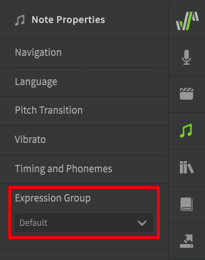
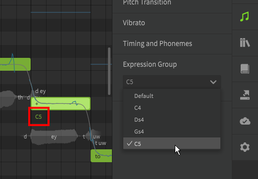

# Expression Groups

The Expression Group dropdown can be found at the bottom of the Note Properties panel.

!!! info "Expression Groups are only applicable to non-AI singers."

## Expression Group Selection
Non-AI voice database include the same set of samples recorded at different voice registers, and sometimes with different vocal styles.

By default the most appropriate sample will be selected for each note, but you can manually override the selection by selecting the desired expression group. The available expression groups will be different for each voice database.

When an expression group is selected for a note, it will be indicated below the note in the piano roll.

---

[Report an Issue](https://github.com/claire-west/svstudio-manual/issues/new?template=report-a-problem.md&title=[Page: Expression Groups])