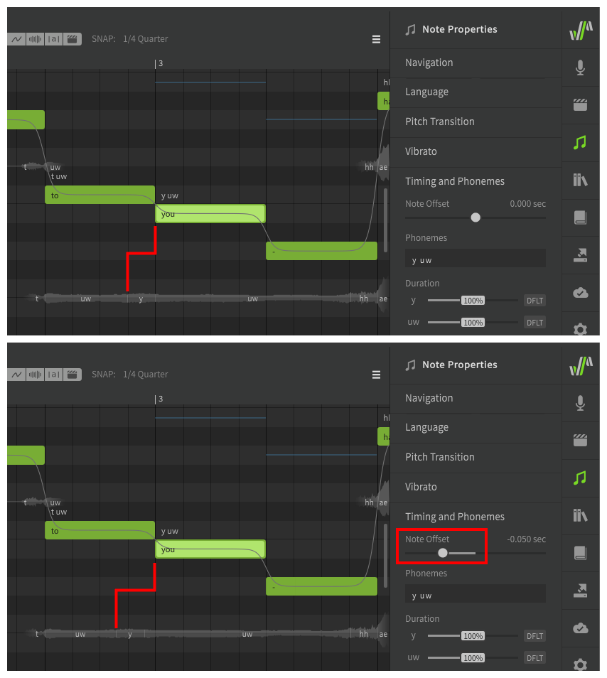
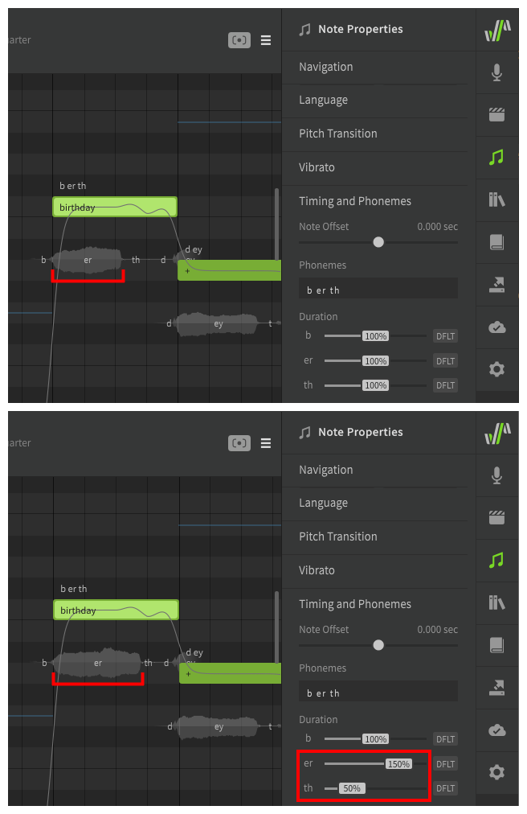
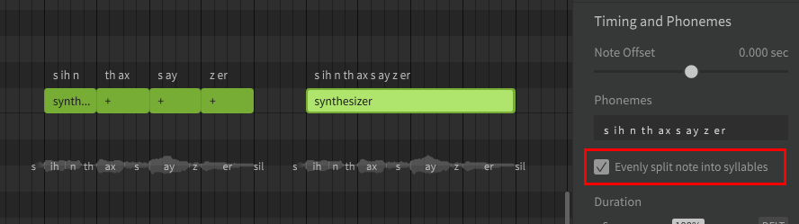
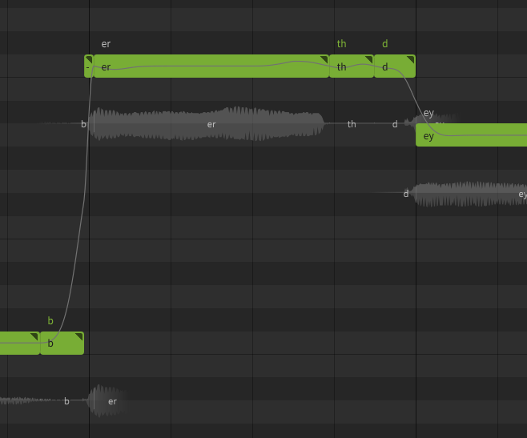

--8<--
notice.md
--8<--

# Note and Phoneme Timing

Note Timing properties allow you to adjust the distribution or duration of phonemes within a note, or entire notes relative to their neighbors.

## Note Offset

The note offset slider will move the beginning of the selected note(s) earlier or later by up to 0.1 second, and will adjust the neighboring phoneme timing appropriately.

!!! note

    It is normal for a note's first phoneme to begin before the note itself if the note begins with a consonant sound. This is done to replicate how human vocalists transition between lyrics and is referred to as a "preutterance".

## Phoneme Timing

Default phoneme timing is determined based on the phoneme's type (vowel, stop, fricative, etc), as well as the pronunciation used by the original vocalist that the voice database is based on.

The timing distribution of phonemes within a note (and relative to its neighbors) can be modified between 20% and 180% of this default.

!!! note

    It will generally be easier to accomplish a desirable timing if you do not include multiple syllables within the same note. Use the `+` character to [allocate a lyric's syllables](../quickstart/entering-lyrics.md) across multiple notes, or [manually allocate](editing-phonemes.md#separating-words-in-unique-ways) the phonemes to multiple notes.

### Evenly Split Note Into Syllables

A multi-syllable lyric entered in a single note will be treated as a series of equal-length notes with syllable breaks while the "Evenly split note into syllables" checkbox is enabled.

This is suitable for multi-syllable words that do not change pitch over the entire duration, and which have equal timing for each syllable. Lyrics that do not meet this critera should have their syllables split across multiple notes with syllable breaks (`+`).

Notice how in this example, the phoneme timings are exactly the same for each instance of the word "synthesizer".

### Words With Ambiguous Syllable Boundaries

Some words, such as "fire", can be either one or two syllables based on the desired pronunciation or accent, or may not have clearly defined syllable boundaries. In these cases, it may be appropriate to include the entire word in a single note and disable the "Evenly split note into syllables" checkbox to treat the entire word as a single syllable.

### More Precise Timing Adjustments

If the phoneme timing sliders do not offer enough precision, or the timing needs to be adjusted beyond the 20-180% range, it can be helpful to separate each phoneme into its own note.

If a note only has a single phoneme, the phoneme's duration will align with the note boundaries regardless of the usual preutterance or automatic timings that would normally apply to a note with a longer phoneme sequence.

Keep in mind that this may result in an unnatural and over-quantized sound if all notes are snapped to the grid.

---

[Report an Issue](https://github.com/claire-west/svstudio-manual/issues/new?template=report-a-problem.md&title=[Page: Phoneme Timing])
