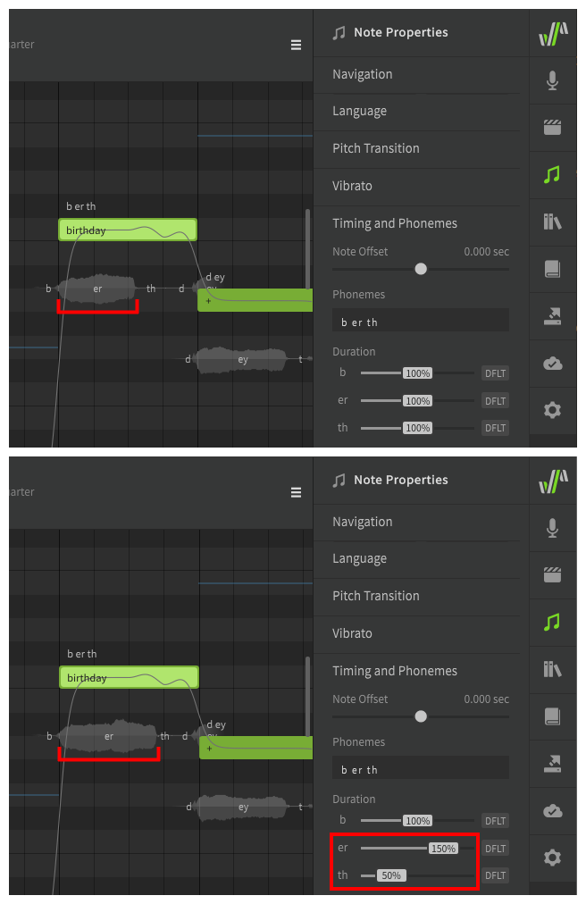

# Note and Phoneme Timing

Note Timing properties allow you to adjust the distribution or duration of phonemes within a note, or entire notes relative to their neighbors.

## Note Offset

The note offset slider will move the beginning of the selected note(s) earlier or later by up to 0.1 second, and will adjust the neighboring phoneme timing appropriately.

!!! note

    It is normal for a note's first phoneme to begin before the note itself if the note begins with a consonant sound. This is done to replicate how human vocalists transition between lyrics and is referred to as a "preutterance".

## Phoneme Timing

Default phoneme timing is determined based on the phoneme's type (vowel, stop, fricative, etc). The timing distribution of phonemes within a note (and relative to its neighbors) can be modified between 20% and 180% of this default.

### More Precise Timing Adjustments

If the phoneme timing sliders do not offer enough precision, or the timing needs to be adjusted beyond the 20-180% range, it can be helpful to separate each phoneme into its own note.

If a note only has a single phoneme, the phoneme's duration will align with the note boundaries regardless of the usual preutterance or automatic timings that would normally apply to a note with a longer phoneme sequence.

Keep in mind that this may result in an unnatural and over-quantized sound if all notes are snapped to the grid.

---

[Report an Issue](https://github.com/claire-west/svstudio-manual/issues/new?template=report-a-problem.md&title=[Page: Phoneme Timing])