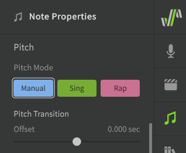

# Pitch Transition and Vibrato

Transitions and vibrato are used to create a more natural flow between notes which does not adhere to the notes' exact pitch.

## Pitch Modes

The Pitch Mode setting has three options, which can be selected from the Note Properties panel while at least one note is selected.

The chosen mode will determine which tools are available for modifying pitch transitions and vibrato.

**Manual**
: Gives full manual control over the pitch. Notes will have no pitch deviation by default, so it is up to the user to enter the desired patterns from scratch. [More about Manual Pitch Mode](../advanced/pitch-mode-manual.md).

**Sing**
: Adds AI-generated pitch deviations to your notes which are modeled to produce realistic transitions, sustains, and vibrato. [More about Sing Pitch Mode](../ai-functions/pitch-mode-sing.md).

**Rap**
: Adds AI-generated pitch deviations to your notes which are modeled to mimic human rap techniques, and allows the use of the Rap Intonation parameter. [More about Rap Pitch Mode](../ai-functions/pitch-mode-rap.md).

---

[Report an Issue](https://github.com/claire-west/svstudio-manual/issues/new?template=report-a-problem.md&title=[Page: Transition and Vibrato])