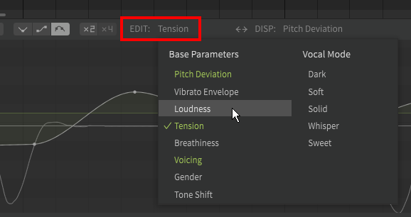

# Editing Parameters

Parameters offer detailed manual control over various aspects of a vocal sequence.

## Parameter Types

**Pitch Deviation**
: A layer of pitch shifts added to the base pitch curve. 100 cents is equivalent to 1 semitone.

**Vibrato Envelope**
: Amplitude modulation of vibrato.

**Loudness**
: Vocal effort/dynamics.

**Tension**
: Sharpening/relaxation of the voice.

**Breathiness**
: The amount of air flow.

**Voicing**
: Interpolation between normal phonation and whispering.

**Gender**
: Formant shifting.

**Tone Shift** (AI voice databases only)
: Modifies the tone of the voice without changing the pitch.

!!! note "Pro Feature - Tone Shift is only available in Synthesizer V Studio Pro."

**Vocal Modes** (AI voice databases only)
: Modifies the [vocal mode](../ai-functions/vocal-modes.md) settings for the voice.
: Each AI voice database has different vocal modes, and each vocal mode can be selected as a parameter and will have its own associated parameter curve.

!!! note "Pro Feature - Vocal Modes are only available in Synthesizer V Studio Pro."

## Base Values

The base value of most parameters can be set in the Voice panel. The curves in the parameters panel will modify the value from this base setting.

### Vibrato Envelope

The Vibrato Envelope parameter affects the amplitude (depth) vibrato in its duration.

Rather than a base value set in the Voice panel, the curve modifies the vibrato depth setting of the note as defined in the Note Properties panel when using Manual Pitch Mode, or the note's Vibrato Modulation setting when using "Sing" Pitch Mode.

### Base Value Indicator

When the base value is set for the parameter currently being edited, a green horizontal line will indicate the the base value relative to the default (indicated by the light grey horizontal line).

## Editing Parameter Curves

### Selecting a Parameter

Clicking on the current editing parameter label will open the parameter selection dropdown.

The currently selected parameter will be indicated with a checkmark, and any parameters with associated curves will be indicated in green.

Select a parameter or [vocal mode](../ai-functions/vocal-modes.md) to set it as the current editing parameter.

### Pointer Tool (point-based)

All parameter curves are composed of points (sometimes referred to as "nodes") and the interpolated lines joining them.

The pointer tool (++alt+1++) can add and move points, and is suited to creating smooth curves and making adjustments to existing curves.

Double click to add a point.

The pointer tool can also select points and move them, just like with notes in the piano roll.

#### Point Movement Modifiers

Modifier keys can be held to change the behavior of dragging point(s) with the mouse.

|Held Modifier|Behavior|
|---|---|
|++shift++|Vertical movement only|
|++ctrl++|Horizontal movement only|
|++shift+ctrl++|Fine control with no snapping to zero|

### Pencil Tool (freehand)

The pencil tool (++alt+2++) allows you to draw the curve directly by clicking and holding down the left mouse button as you draw with the cursor.

This can be used to customize a note transition, draw unique vibrato, or introduce a variety of pitch deviations to achieve your desired singing style.

Holding right click will instead clear any curves along the area the mouse passes over.

### Line Tool

The line tool (++alt+3++) will introduce two points, one at each end of the line drawn with the mouse.

If either end of the drawn line is in proximity to an existing point, the existing point will be moved to the spot where the line began or ended.

### Curve Types

The curve type setting changes how the curves between points are interpolated.

The first setting (Linear) will draw straight lines between the points.

The second (Cosine) will ensure a horizontal line on either side of a point before curving toward the neighboring points.

The third and final type (Adaptive Spline) will produce the smoothest curve connecting each point.

<figure markdown>
  
  <figcaption>A comparison of interpolation types</figcaption>
</figure>

### Automation Indicator

Any parameters that have curves associated with them will have an automation indicator in the Voice panel as a reminder that the parameter is being modified from its base value.

The actual value of a parameter (the base value plus the parameter curve) will be displayed on the slider in the Voice panel based on the current playhead position, and will reflect the real-time value of the parameter during playback.

## Additional Functions

Additional options for parameter editing can be found in the "Editor" section of the Settings panel.

Hide points in freehand mode
: When the pencil tool is selected, the dots for each individual point will be hidden.

Auto-insert anchor points
: If a point is placed within the duration of a note and no nearby points are present, anchor points will be placed before and after the note.

Simplify freehand drawn curves
: Automatically simplify curves drawn with the pencil tool. This will reduce the number of points and may improve performance, but also may cause the final curves to not follow the freehand line precisely.

Snap points to zero
: May need to be disabled if moving points to precise values near zero.

### Simplify Parameters

The Simplify Parameters option can be found under the "Modify" top menu.

This function reduces the number of points in a selection to smooth a curve, at the cost of precision. The resulting curve may not match the original exactly.

## Video Demonstration

<iframe width="560" height="315" src="https://www.youtube-nocookie.com/embed/agSYwd_LQZU" title="YouTube video player" frameborder="0" allowfullscreen></iframe>

---

[Report an Issue](https://github.com/claire-west/svstudio-manual/issues/new?template=report-a-problem.md&title=[Page: Editing Parameters])