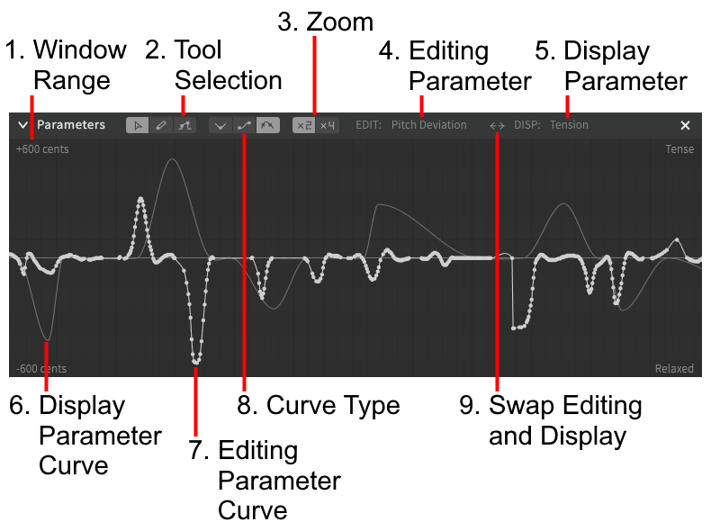
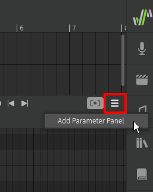
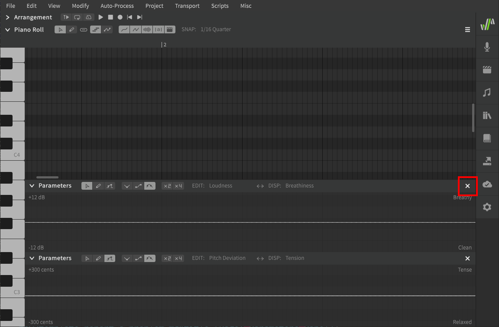

--8<--
notice.md
--8<--

# The Parameters Panel

### 1. Window Range
The minimum and maximum range indicators for the currently selected parameter.

### 2. Tool Selection
Swap between the pointer, pencil, and line tools.

### 3. Zoom
Multiplies the window range by 2 or 4 times. Not all parameters can be zoomed.

Disabled is the most "zoomed in", while 4x is the largest multiplier of the visible range, and is therefore more "zoomed out".

### 4. Editing Parameter
The current parameter being edited in the foreground of the parameters panel.

### 5. Display Parameter
A parameter to display for reference behind the current editing parameter.

### 6. Display Parameter Curve
The curve associated with the selected display (background) parameter.

### 7. Editing Parameter Curve
The curve associated with the selected editing (foreground) parameter.

### 8. Curve Type
Select different behaviors for interpolating the curve between points.

### 9. Swap Editing and Display
Swap the editing (foreground) and display (background) parameters.

## Multiple Parameter Panels

Additional parameter panels can be added to the workspace with the three-bars (:fontawesome-solid-bars:) icon in the upper right of the Piano Roll.

Unneeded parameter panels can also be removed by clicking the ✖ icon on the far right side.

---

[Report an Issue](https://github.com/claire-west/svstudio-manual/issues/new?template=report-a-problem.md&title=[Page: Parameters Panel])
