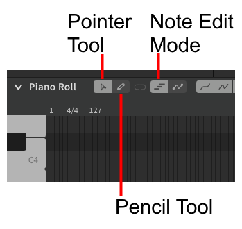

# Editing Notes

Note editing varies based on the selected tool. Ensure you are in Note Edit Mode before trying to modify notes.

## Selecting Notes

Notes can be selected by clicking on them.

To select multiple notes at once, use the pointer tool (++alt+1++) to drag a bounding box around them.

Select all notes in the current track or group with ++ctrl+a++.

Multiple notes can also be selected or deselected by clicking on them individually while holding ++ctrl++.

A continuous sequence of notes can be selected by clicking the first note, holding ++shift++, and clicking the last note.

You can also use bounding box selection with the pencil tool (++alt+2++) by double clicking (without releasing the left button after the second click) and dragging with the mouse, similar to how [new notes](creating-notes.md#pointer-tool) are added with the pointer tool.

## Modifying Notes

Notes can be moved by clicking and dragging them. If multiple notes are selected, the entire selection will be moved.

To change a note's duration, click and hold on the head or tail (left or right edge of the note) and drag to the desired length.

### Note Movement Modifiers

Modifier keys can be held to change the behavior of dragging note(s) with the mouse.

|Held Modifier|Behavior|
|---|---|
|++shift++|Vertical movement only|
|++ctrl++|Horizontal movement only|
|++ctrl+alt++|Do not snap to grid|

## Overlapping Notes

Output cannot be synthesized for notes that overlap. Overlapping notes will be disabled and will not produce any sound.

Resize the notes so that they do not overlap, and synthesized output will be restored.

## Short Silences

The end of one note should generally meet with the start of the next note unless there is intended to be silence between them.

If there is a small gap between two notes (1/16 quarter or smaller) a `sil` (silence) indicator will be displayed.

Clicking the `sil` indicator will close the gap between the notes.

Short silences can also be removed from many notes at once via the "Modify" top menu.

## Video Demonstration

<iframe width="560" height="315" src="https://www.youtube-nocookie.com/embed/_s1gITI3vbA" title="YouTube video player" frameborder="0" allowfullscreen></iframe>

---

[Report an Issue](https://github.com/claire-west/svstudio-manual/issues/new?template=report-a-problem.md&title=[Page: Editing Notes])