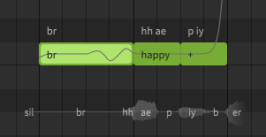
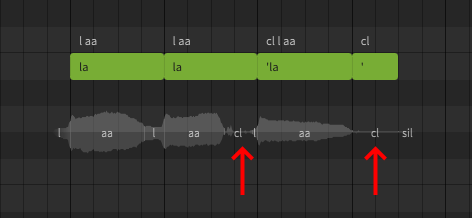

# Entering Lyrics

### 1. Lyric Entry
Double click on a note to enter a lyric. Press ++enter++ or click outside the note to confirm, or press ++esc++ to cancel the change.

Pressing ++tab++ will confirm the change and advance to the next note, while ++ctrl+tab++ will move to the previous note.

### 2. Syllable Break
Use the plus sign (`+`) to distribute a multi-syllable word across multiple notes.

### 3. Legato
Use the minus sign (`-`) to continue the last sung vowel into the following note.

## Combining Syllable Breaks and Legato
Multi-syllable words and melismas may require a combination of syllable breaks (`+`) and legato (`-`).

In this example the word "amazing" has its three syllables extended across six notes.

|Note|Lyric/Symbol|Syllable|
|---|---|---|
|1|amazing|First|
|2|`-` (minus)|First (continued)|
|3|`+` (plus)|Second|
|4|`+` (plus)|Third|
|5|`-` (minus)|Third (continued)|
|6|`-` (minus)|Third (continued)|

## Adding Breaths
Breath notes can be added by entering `br` as the note's lyric (AI singers only).

## Adding Glottal Stops
Glottal stops can be added between notes by prefixing the following lyric with a single quote (`'`). A note containing just a single quote can be used to add a glottal stop at the end of a phrase.

## Instant Mode

While adding and modifying notes you may notice that the pitch line does not follow the exact positions of the notes. This indicates that you have [Instant Mode](../ai-functions/instant-mode.md) enabled for your project.

Instant Mode will add AI-generated pitch deviations to your notes which are modeled to mimic human singing techniques.

In some ways, Instant Mode is comparable to the preset libraries included with traditional software synthesizers and effects plugins; it offers a simplified workflow which can help inexperienced users get results quickly, and acts as a starting point for learning what realistic pitch curves might look and sound like.

<figure markdown>
  
  <figcaption>The default pitch curve (left) and the same notes with Instant Mode enabled (right)</figcaption>
</figure>

If you do not want to use the simplified workflow offered by Instant Mode, and prefer more manual control, you may wish to disable it with the button in the upper right corner of the piano roll.

Instant Mode can be disabled by default for new projects by changing the "Enable instant mode by default" option in the Settings panel.

### Removing Instant Mode From an Existing Project

If you have already been working on your project, disabling Instant Mode will not remove all of the pitch changes it added.

Disabling Instant Mode will stop it from generating new patterns, but existing patterns will be moved to the Parameters panel for manual editing. This topic will be discussed later in the user manual, but for now you can remove any remaining patterns with the following steps:

1. Expand the Parameters panel, if it is not already open. If there is no Parameters panel below the piano roll, you can open a new one from the three-bars (:fontawesome-solid-bars:) button beside the Instant Mode button shown above.
2. Ensure the "EDIT:" setting is set to "Pitch Deviation".
3. Click within the Parameters panel and press ++ctrl+a++ to select all points.
4. Press ++del++.

## Video Demonstration

<iframe width="560" height="315" src="https://www.youtube-nocookie.com/embed/Gj7UipbHBdw" title="YouTube video player" frameborder="0" allowfullscreen></iframe>

---

[Report an Issue](https://github.com/claire-west/svstudio-manual/issues/new?template=report-a-problem.md&title=[Page: Entering Lyrics])