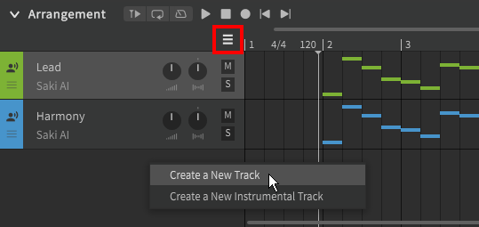
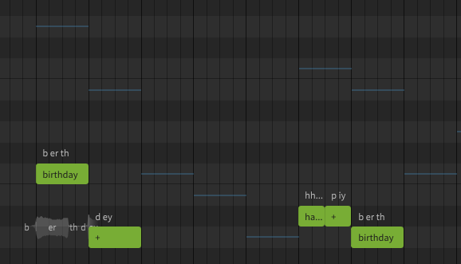
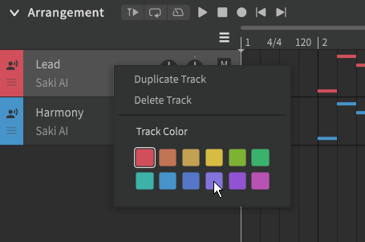
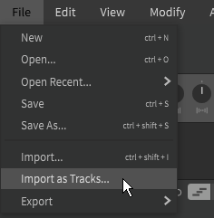

# Managing Tracks

Tracks are displayed in the [arrangement](../workspace/arrangement.md) panel.

## Creating Tracks

There are multiple ways to add a new track:

- Click the three-bars (:fontawesome-solid-bars:) icon to the left of the time axis
- Right click empty space below the existing tracks
- From the "Project" menu at the top of the application window
- Drag an instrumental (wav or flac) file into the arrangement

!!! note "Pro Feature - Track Limit"

    Synthesizer V Studio Basic is limited to 3 tracks. The pro edition removes this limitation.

!!! warning

    Using an instrumental file in mp3 format may result in desynchronized audio.

Selecting "Create a New Track" will add a new vocal track to the bottom of the list, with no voice database selected by default. The track color will be automatically assigned based on which colors are already in use.

Creating a new instrumental track will automatically prompt for an audio file to be selected. Each instrumental track can only contain one audio file.

Double-click on a track's name to rename it.

Right click on a track to duplicate or delete it. Unlike new tracks, duplicated tracks will have the same track color as the original they were cloned from.

Notes from other tracks will be shown in the piano roll as colored lines. This can be disabled with the "Show Melody from Other Tracks" option in the "View" menu at the top of the application window.

### Changing a Track's Color

A track's color can be changed from the right click menu.

The track color is used in the Arrangement panel, as well as for the horizontal lines used to show non-current tracks in the Piano Roll. The color of the current track's notes in the Piano Roll is based on each note's pitch mode ("Sing" or "Rap"), not the track's assigned color.

## Importing Tracks

There are two options in the "File" menu at the top of the application that allow importing of tracks.

"Import" (++ctrl+shift+i++) will open the selected file as a new project in Synthesizer V Studio. "Import as Tracks" will create new tracks in the current project based on the selected file.

You can use these functions to load a MIDI file containing the vocal melody for your song, or to import a project file from a different singing synthesizer.

Supported file types are MIDI, UST, VSQx, VPR, and CCS.

The "Import as Tracks" function also supports SVP and S5P files to allow merging of Synthesizer V projects.

### Importing Tempo and Time Signature Markers

The "Import" function will also apply tempo and time signature markers based on the original file.

"Import as Tracks" will not modify the tempo or time signature markers of the current project.

To apply a MIDI tempo map to an existing project:

1. Save your work if you have any unsaved changes.
2. Use "Import" to create a new project based on your MIDI file. The new project's tempo and time signature markers will reflect those of the MIDI file.
3. Use "Import as Tracks" to merge your existing SVP file into the new project.
4. Save the new project under a new name.

!!! info "Some DAWs and music notation programs do not include tempo or time signature information when exporting a MIDI file."

!!! warning

    Neither Synthesizer V Studio nor the MIDI format support gradual ("ramp") tempo changes. Ensure all tempo changes are applied in an instantaneous or stepwise manner, and that all tempo changes occur at the start of a quarter.

## Video Demonstration

<iframe width="560" height="315" src="https://www.youtube-nocookie.com/embed/sz1TwwXmMJA" title="YouTube video player" frameborder="0" allowfullscreen></iframe>

---

[Report an Issue](https://github.com/claire-west/svstudio-manual/issues/new?template=report-a-problem.md&title=[Page: Managing Tracks])