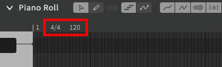

--8<--
notice.md
--8<--

# Setting Up the Score

The time axis displays time signature and tempo markers above the arrangement and piano roll.

To modify a marker, double click on it. To delete a marker (not including markers at measure 1), right click on it and select "Delete".

New markers of either type can be added by right clicking along the time axis. Tempo markers can also be added by double-clicking along the time axis.

Tempo markers can only be created at quarter-measure intervals, and time signature changes can only occur at the start of a measure.

!!! warning

    Neither Synthesizer V Studio nor the MIDI file format support gradual ("ramp") tempo changes.

    When synchronizing with an accompanying instrumental, ensure all tempo changes are applied in an instantaneous or stepwise manner in both programs, and that all tempo changes occur at the start of a quarter.

---

[Report an Issue](https://github.com/claire-west/svstudio-manual/issues/new?template=report-a-problem.md&title=[Page: Setting up the Score])
