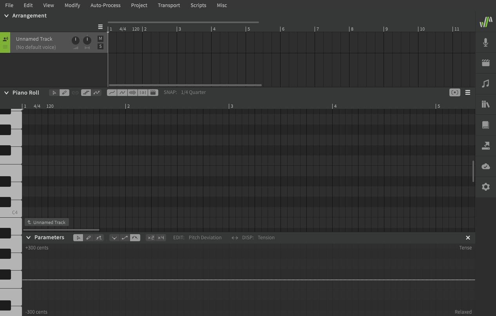
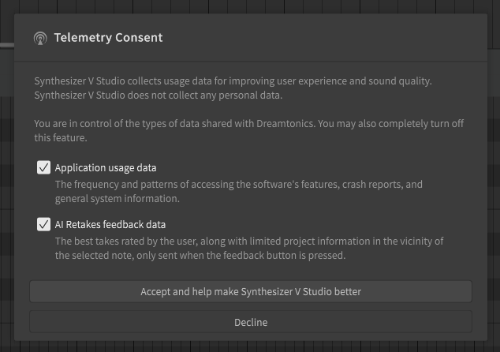
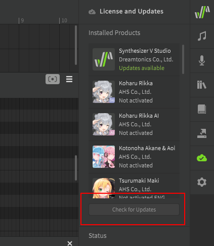
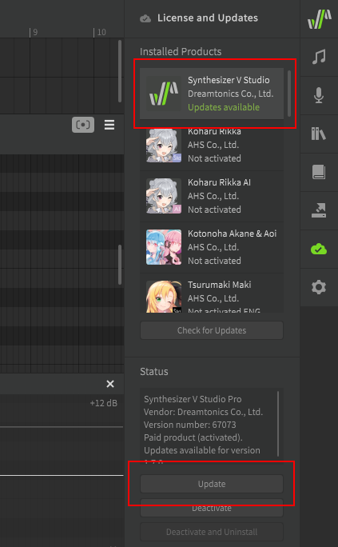

# Setup and Activation

## Download

Download links for Synthesizer V Studio Basic Edition and purchase links for the Pro Edition can be found on the official [Dreamtonics website](https://dreamtonics.com/en/synthesizerv/).

After purchasing the Pro edition your order confirmation email will include download instructions which may vary based on the vendor you purchased from.

!!! warning

    Always save your order confirmation emails and keep your product activation codes in a safe place. The vendor you purchase from will not always be able to help recover lost or compromised activation codes.

## Installation (Windows & Mac)

Execute the installer (.exe format on Windows, .pkg format on Mac) by double-clicking it, or by selecting it in your file browser and pressing ++enter++. Follow the on-screen instructions.

If installing the Pro edition you will be prompted for your product activation code upon launching the application.

Once you have successfully installed the software (and activated it, if necessary) you will be presented with the following application window.



### Installing a Voice Database

To install a voice database, double-click the .svpk file or drag-and-drop it from your file browser into the Synthesizer V Studio window. A voice database installation dialog will be displayed. Follow the on-screen instructions.

If installing a paid voice database product you will be prompted for your product activation code.

Once you have successfully installed a voice database (and activated it, if necessary) it will be listed in the singer selection dropdown.


## Installation (Linux)

Navigate to your desired install directory and unzip the downloaded archive. If you are extracting to a location outside your home directory (`~`), you may need to run `unzip` as root (ie with `sudo`) such as in this example where Synthesizer V Studio is being extracted to `/opt`:

=== "Pro Edition"
    ```
    cd /opt
    sudo unzip ~/Downloads/svstudio-pro-linux64.zip
    ```

=== "Basic Edition"
    ```
    cd /opt
    sudo unzip ~/Downloads/svstudio-basic-linux64.zip
    ```

If extracting to a location outside your home directory you may also need to modify the ownership or permissions of the files. This example will work for most situations:

=== "Pro Edition"
    ```
    sudo chown -R $(whoami):$(whoami) "Synthesizer V Studio Pro"
    ```

=== "Basic Edition"
    ```
    sudo chown -R $(whoami):$(whoami) "Synthesizer V Studio Basic"
    ```

Launch the application by running the synthv-studio executable from the terminal.

=== "Pro Edition"
    ```
    cd "Synthesizer V Studio Pro"
    ./synthv-studio
    ```

=== "Basic Edition"
    ```
    cd "Synthesizer V Studio Basic"
    ./synthv-studio
    ```

If installing the Pro edition you will be prompted for your product activation code.

Once you have successfully installed the software (and activated it, if necessary) you will be presented with the following application window.


### Installing a Voice Database

To install a voice database, run the synthv-studio executable from the terminal and provide the .svpk file as an argument. The exact file name will vary depending on the voice database you are installing.

`./synthv-studio ~/Downloads/saki-ai-lite-install-101.svpk`

The application will launch and a voice database installation dialog will be displayed. Follow the on-screen instructions.

If installing a paid voice database product you will be prompted for your product activation code.

Once you have successfully installed a voice database (and activated it, if necessary) it will be listed in the singer selection dropdown.


## Telemetry Consent

Upon launching the software for the first time, you will be presented with the Telemetry Consent dialog.

These options can always be changed via the "Configure usage data collection" button near the top of the Settings panel.



### Application usage data

If checked, information about how you use the software will be sent to Dreamtonics. This includes how often each feature is used, render times, crash reports, and other anonymous data.

This information can help the development team identify which features might be confusing to users, which features are considered most useful, any hardware configurations that cause poor performance, etc.

### AI Retakes feedback data

If checked, information about [AI Retakes](ai-functions/ai-retakes.md) you "Like" (those marked with the heart icon) will be sent to Dreamtonics.

These preferred takes can be used by the development team to refine the AI pitch models to improve the reliability, consistency, and realism of the synthesized voices in future updates.

The transmitted retakes include minimal snippets of project data required to reconstruct your preferred retake, such as note duration and pitch, phoneme data, the selected voice database, etc. This collected data is strictly controlled by Dreamtonics and is used exclusively for research and development purposes.

## Updating the Software

Open the License and Updates panel and click "Check for Updates" to search for updates.



When an available update is shown under the product name, select the product and click the "Update" button below the list. The software will begin to download the update package and you will be guided through the installation process.



## Deactivating a Product

When you need to transfer your license to a new device, perform hardware/firmware upgrades, or reinstall your operating system, you must first revoke the license by deactivating the product.

To deactivate a product select it in the "License and Updates" panel and click the "Deactivate" button below. The activation on the current device will be revoked, and can be safely reactivated on the new or upgraded device.

!!! note

    Ensure that all voice databases are deactivated before deactivating or uninstalling Synthesizer V Studio. If you proceed with the uninstallation while activated voices remain on the system, you can recover the licensing status for the voices by reinstalling and reactivating Synthesizer V Studio.


## Troubleshooting

If you encounter technical issues with the software, try removing the software and reinstalling to the default installation directory. Windows users may need to run the installer as administrator, and Linux users should verify the file permissions of the Synthesizer V Studio directory.

If the problems persist, search for similar issues on the [official forums](https://forum.synthesizerv.com/search) or contact [Dreamtonics support](support.md).

---

[Report an Issue](https://github.com/claire-west/svstudio-manual/issues/new?template=report-a-problem.md&title=[Page: Setup])