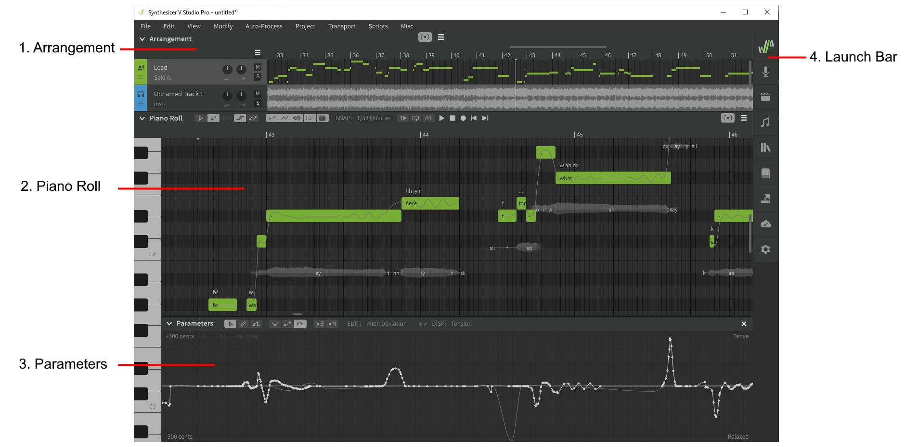

# The Workspace

Shown below is the workspace for a typical project with an instrumental track.

### 1. Arrangement
Displays vocal and instrumental tracks with basic mixer controls, time axis information, and an overview of track contents. Also displays transport/playback controls when focused by user input.

### 2. Piano Roll
The main panel for note creation, editing, and pitch/timing visualization. Also displays transport/playback controls when focused by user input.

### 3. Parameters
A panel for viewing and modifying [parameter curves](../../parameters/parameters-panel) to influence vocal behavior over time.

### 4. Launch Bar
Buttons for opening the various [side panels](side-panels.md).

## Workspace Navigation
Aside from using the scrollbars on the bottom and right borders, you can conveniently navigate in all directions using ++"modifier key"+mouse-wheel++ combinations.

|Shortcut|Description|
|---|---|
|++mouse-wheel++|Vertical scroll|
|++shift+mouse-wheel++|Horizontal scroll|
|++ctrl+mouse-wheel++|Horizontal zoom (mouse-centered)|

At the time of writing there is no support for vertical zoom.

The modifier key used for each of these functions can be customized in the Settings panel.

## The Status Bar
If the "Show status bar" option is enabled in the Settings panel, a status bar will be visible at the bottom of the application window.

The status bar shows contextual information depending on the current mouse cursor position.

## Video Demonstration

<iframe width="560" height="315" src="https://www.youtube-nocookie.com/embed/5f50-Ircdvs" title="YouTube video player" frameborder="0" allowfullscreen></iframe>

---

[Report an Issue](https://github.com/claire-west/svstudio-manual/issues/new?template=report-a-problem.md&title=[Page: Workspace])