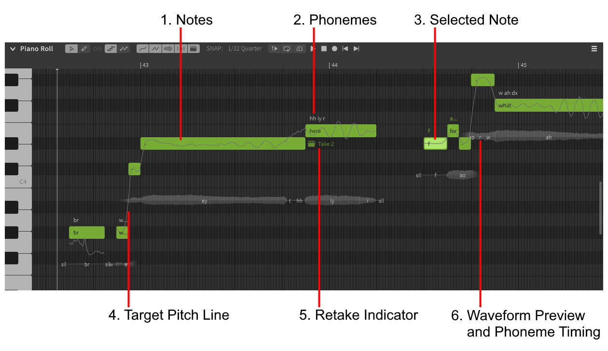

# The Piano Roll

## Piano Roll Toolbar

### 1. Tool Selection
Allows changing between the pointer and pencil tools. The pointer is suited to selecting and modifying notes, while the pencil allows for quicker note creation and freehand pitch drawing.

### 2. Visibility Toggles
Toggles the visibility of various elements of the piano roll:

- Target pitch
- Actual pitch (non-AI singers only)
- Waveform preview
- Phoneme timing
- Retake indicators

### 3. Transport Controls
When the piano roll is focused by user input, the [transport controls](../quickstart/playback.md) will be displayed.

### 4. Time Axis
Measure (bar) numbers, as well as time signature and tempo (BPM) markers.

### 5. Editing Mode
Toggles between note editing and pitch editing modes.

### 6. Snap Setting
Sets the grid snap interval for the piano roll.

### 7. Instant Mode Toggle
Enables or disables [Instant Mode](../ai-functions/instant-mode.md), which applies AI-generated pitch deviations to the notes as changes are made.

### Tool/Mode Link
The chain-link icon can be toggled on to toggle both the selected tool and current editing mode when either option is changed.

## Piano Roll Main Window

### 1. Notes
Notes are displayed in the piano roll as green rectangles, with their vertical position (pitch) corresponding to the piano key on the left and their horizontal position (timing) corresponding to the time axis above.

### 2. Phonemes
Phonemes represent the actual sounds produced by a singer. Each lyric entered in a note will automatically be converted to phonemes.

### 3. Selected Note
The currently selected note(s) will be highlighted.

### 4. Target Pitch Line
The exact pitch that the synthesis engine will attempt to match when rendering audio output.

#### 4a. Actual Pitch Line
When using a non-AI singer, a blue line will closely follow the target pitch line. This represents the actual rendered pitch of the synthesized vocals.

### 5. Retake Indicator
!!! note "Pro Feature - AI Retakes"

    If using AI Retakes, indicates which take is being used for the note.

### 6. Waveform Preview and Phoneme Timing
A preview of the waveform for the note, as well as timing indicators for the individual phonemes associated with it.

---

[Report an Issue](https://github.com/claire-west/svstudio-manual/issues/new?template=report-a-problem.md&title=[Page: Piano Roll])